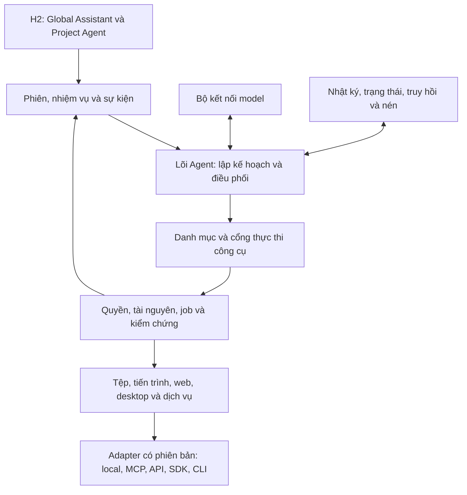

# H2 Agent — Báo cáo hợp nhất hiện trạng, đối chiếu và giải pháp

Ngày: **22/09/2026**. Mã H2 đối chiếu: `9265c75c4be60e4019d655ef049f66ffc6f779bc`.

**Trạng thái: rà soát và đề xuất; chưa triển khai.** Báo cáo hợp nhất hai tài liệu: [đối chiếu Agent mã nguồn mở](H2_DESKTOP_AGENT_COMPARISON_2026-09-22.md) và [rà soát, mục tiêu H2](H2_AGENT_AUDIT_AND_GOALS_2026-09-22.md). Hai bản nguồn được giữ để truy vết; dùng bản này làm đầu mối đọc kết quả và giải pháp của đợt nghiên cứu.

Các thay đổi của đợt nghiên cứu chỉ thuộc tài liệu. Chưa sửa mã ứng dụng, thay backend, cài/chạy Agent bên ngoài, build bản mới hay đẩy GitHub. Báo cáo không đánh dấu hoàn thành các mục triển khai và không thay thế thẩm quyền của [Agent Master](H2_AGENT_MASTER_SPEC.md), [Product Master](H2_PRODUCT_MASTER_SPEC.md) và [Chat Surface](H2_AGENT_CHAT_SURFACE_SPEC.md).

## 1. Mục tiêu, cách đánh giá và kết quả tổng thể

### 1.1. Mục tiêu người dùng yêu cầu

H2 cần một Agent tổng quát có thể phối hợp tệp, chương trình, trình duyệt, ứng dụng desktop và dịch vụ để thực hiện công việc thực tế. Bộ công cụ phải có đủ thao tác trong phạm vi công bố, mở rộng được, thay thế được và có khả năng chuyên biệt cho Word, Excel, AutoCAD, PDF, OCR cùng các ứng dụng bổ sung về sau.

Agent phải biết dò môi trường, chọn đúng tài nguyên, chờ tác vụ dài, phân tích lỗi, thử cách xử lý phù hợp và kiểm chứng kết quả. Khi cần điều chỉnh kết nối theo phiên bản, có thể thử adapter/script riêng trong phạm vi quyền; không phụ thuộc vào việc sửa trực tiếp bộ công cụ chuẩn mỗi lần gặp môi trường mới.

Agent cũng cần làm việc dài với ngữ cảnh đầu vào được kiểm soát, giữ đúng yêu cầu đã thay đổi, việc đã làm, việc chưa hoàn thành và bằng chứng kết quả. Việc nén phải đi cùng trí nhớ bền vững và khả năng truy hồi.

Đánh giá ở đây **không tính chất lượng model**. Tuy vậy, chọn model vẫn cần đáp ứng giao thức và loại dữ liệu mà một công việc yêu cầu; kiến trúc phải dò khả năng và báo đúng giới hạn đó.

### 1.2. Phạm vi bằng chứng

Phân biệt ba mức trong toàn báo cáo:

- **Xác nhận trong mã:** nhánh gọi, giới hạn, hợp đồng và cách xử lý được đọc trực tiếp.
- **Suy luận kỹ thuật:** tình huống có thể phát sinh từ thiết kế; cần tái hiện để xác định mức ảnh hưởng.
- **Chưa nghiệm thu:** chức năng hoặc phạm vi chưa chạy trực tiếp trong đợt này, kể cả khi đã có interface hay bài kiểm thử giả lập.

Chưa chạy thử nhiều giờ, tái hiện lỗi Word mới nhất, thử crash/restart, đo chất lượng nhớ với model người dùng hoặc kiểm tra đa phiên bản Office/AutoCAD. Không suy rằng một thiếu sót trong mã chắc chắn là nguyên nhân của đúng lần lỗi trên màn hình.

### 1.3. Điểm trưởng thành hiện tại

**Ước lượng tổng thể: 4/10 so với mục tiêu Agent tổng quát đã nêu.** Đây là nhận định kỹ thuật, không phải benchmark với Codex, tỷ lệ thành công hay tuyên bố H2 đạt 40% Codex.

Mốc tham chiếu: 2 = mới có một phần khả năng; 4 = có công việc thật nhưng còn khoảng trống nền tảng; 6 = luồng sản phẩm tương đối đầy đủ trong phạm vi hỗ trợ; 8 = ổn định qua các ca lỗi và nhiều môi trường; 10 = đạt các mục tiêu và điều kiện nghiệm thu đã công bố. Không mốc nào mang nghĩa làm được mọi việc tuyệt đối.

| Mặt đánh giá | Điểm /10 | Nhận định |
|---|---|---|
| Khung kiến trúc mở | 6 | Có registry, provider, extension, model transport, quyền và verifier; khả năng thay thế qua sản phẩm thật chưa được nghiệm thu đầy đủ |
| Độ đầy đủ của công cụ | 4 | Có file/Python/Office, PowerShell, đọc web và desktop; độ rộng thao tác, nhận diện đích và tương thích còn hạn chế |
| Tích hợp và điều phối trong H2 | 4 | Có đường Agent thật và tiến độ/kiểm tra; đường context/compaction của Lab và production chưa tương đương |
| Chẩn đoán, sửa lỗi, kiểm chứng | 4 | Có vòng sửa lỗi; chưa chứng minh thích ứng bộ kết nối theo môi trường và phục hồi đầy đủ qua UI |
| Ngữ cảnh và trí nhớ công việc | 2 | Lịch sử gần đây và checkpoint chưa đủ chứng minh nhớ đúng công việc dài sau nhiều lần nén |
| Làm việc dài và tiếp tục sau gián đoạn | 2 | Chưa có phiên tiến trình dài và khả năng nối lại công việc được chứng minh |

Nhận xét trước đây “cấu trúc đi đúng hướng” chỉ nói về những ranh giới kiến trúc đã có. Nó không đồng nghĩa lõi đã hoàn chỉnh hoặc công việc còn lại chỉ là thêm vài lệnh.

## 2. Hiện trạng H2 và các khoảng trống có bằng chứng

### 2.1. Những phần đã có và cần tận dụng

H2 đã có [ToolRegistry](https://github.com/HoangHung997/NotePad/blob/9265c75c4be60e4019d655ef049f66ffc6f779bc/experiments/H2AgentLab/Tools/ToolRegistry.cs), [IAgentExtension](https://github.com/HoangHung997/NotePad/blob/9265c75c4be60e4019d655ef049f66ffc6f779bc/experiments/H2AgentLab/Extensions/AgentExtension.cs), [ICapabilityProvider](https://github.com/HoangHung997/NotePad/blob/9265c75c4be60e4019d655ef049f66ffc6f779bc/experiments/H2AgentLab/Providers/CapabilityProvider.cs), cơ chế tìm/nạp công cụ, model transport, kiểm tra quyền, bộ kiểm chứng và vòng phục hồi. OfficeHost đã có thực thi Office trên STA và các đường đọc lại sau ghi; DesktopHost đã có UI Automation, ảnh cửa sổ và kiểm tra danh tính tiến trình.

Đường runtime chính dùng registry. Không quy lỗi hiện tại cho switch lịch sử trong AgentTools khi chưa chứng minh switch đó được gọi. Bằng chứng: [AgentRuntimeFactory](https://github.com/HoangHung997/NotePad/blob/9265c75c4be60e4019d655ef049f66ffc6f779bc/experiments/H2AgentLab/Runtime/AgentRuntimeFactory.cs#L37).

Các thành phần này cho phép nâng cấp từng phần; chưa có cơ sở chọn viết lại toàn bộ chỉ vì một kết nối đang lỗi.

### 2.2. Điều phối, ngữ cảnh và tác vụ dài

| Mã | Xác nhận từ mã | Tác động hoặc việc cần chứng minh |
|---|---|---|
| F01 | App tạo H2ProductionAgentAdapter; adapter tự dựng AgentContextInput và chạy runtime. Chưa thấy gọi RuntimeCompactionCoordinator như đường AgentOrchestratedRun của Lab | Kết quả nén và boundedness của Lab không tự chứng minh đường H2 production có cùng hành vi |
| F02 | Work Assistant lấy 6 tác vụ Completed gần nhất để dựng lịch sử; bước snapshot giới hạn 32 tin | Việc lỗi/dang dở và quyết định cũ không được giữ đầy đủ chỉ bằng cửa sổ tin gần đây |
| F03 | BuildSummary của bộ nén ghi số sự kiện user/assistant/tool và tham chiếu nguồn | Có checkpoint bền vững, nhưng bản tóm tắt này chưa tự mô tả các quyết định và kết quả công việc |
| F04 | AgentContextBudget dùng ký tự; runtime dựng context đầu lượt; Ollama/ChatCompletions thêm thông điệp và kết quả công cụ qua các vòng | Cần kiểm soát toàn bộ request từng vòng, kể cả tool schemas và ảnh; chưa chứng minh nén trong một lượt dài ở đường đã đọc |
| F05 | exec_command chạy PowerShell không tương tác, đóng stdin, đợi kết thúc và giới hạn tối đa 300 giây | Có chạy lệnh thật nhưng chưa có phiên tiến trình để gửi thêm đầu vào và theo dõi dài hạn |
| F06 | Production đặt 64 vòng công cụ; tác vụ chưa kết thúc chuyển Failed khi archive được nạp lại sau gián đoạn | Cần tiếp nối có checkpoint và đối chiếu kết quả; tăng giới hạn vòng đơn thuần không giải quyết được tính liên tục |
| F07 | Runtime theo dõi lỗi chưa giải quyết, yêu cầu sửa và chặn lặp thao tác sửa thất bại | Có nền tảng phục hồi; chưa nghiệm thu tự chẩn đoán và tạo/thử adapter tương thích theo môi trường |

Bằng chứng:

- F01: [điểm khởi tạo app](https://github.com/HoangHung997/NotePad/blob/9265c75c4be60e4019d655ef049f66ffc6f779bc/src/H2Notes.Avalonia/App.axaml.cs#L336), [context production](https://github.com/HoangHung997/NotePad/blob/9265c75c4be60e4019d655ef049f66ffc6f779bc/experiments/H2AgentLab/Integration/H2ProductionAgentAdapter.cs#L344), [compaction của Lab](https://github.com/HoangHung997/NotePad/blob/9265c75c4be60e4019d655ef049f66ffc6f779bc/experiments/H2AgentLab/Tasking/AgentOrchestratedRun.cs#L152).
- F02: [lịch sử Work Assistant](https://github.com/HoangHung997/NotePad/blob/9265c75c4be60e4019d655ef049f66ffc6f779bc/src/H2Notes.Avalonia/WorkAssistantCompactWindow.Conversation.cs#L128), [snapshot](https://github.com/HoangHung997/NotePad/blob/9265c75c4be60e4019d655ef049f66ffc6f779bc/experiments/H2AgentLab/Integration/H2ProductionAgentAdapter.Context.cs#L25).
- F03/F04: [BuildSummary](https://github.com/HoangHung997/NotePad/blob/9265c75c4be60e4019d655ef049f66ffc6f779bc/experiments/H2AgentLab/Session/RuntimeCompactionCoordinator.cs#L186), [ngân sách](https://github.com/HoangHung997/NotePad/blob/9265c75c4be60e4019d655ef049f66ffc6f779bc/experiments/H2AgentLab/Context/AgentContextManager.cs#L11), [context đầu lượt](https://github.com/HoangHung997/NotePad/blob/9265c75c4be60e4019d655ef049f66ffc6f779bc/experiments/H2AgentLab/Runtime/AgentRuntime.cs#L147), [Ollama](https://github.com/HoangHung997/NotePad/blob/9265c75c4be60e4019d655ef049f66ffc6f779bc/experiments/H2AgentLab/Transport/OllamaTransport.cs#L111), [Chat Completions](https://github.com/HoangHung997/NotePad/blob/9265c75c4be60e4019d655ef049f66ffc6f779bc/experiments/H2AgentLab/Transport/ChatCompletionsTransport.cs#L118).
- F05/F06: [công cụ tiến trình](https://github.com/HoangHung997/NotePad/blob/9265c75c4be60e4019d655ef049f66ffc6f779bc/experiments/H2AgentLab/Integration/H2LocalCommandTool.cs#L25), [ngân sách vòng](https://github.com/HoangHung997/NotePad/blob/9265c75c4be60e4019d655ef049f66ffc6f779bc/experiments/H2AgentLab/Integration/H2ProductionAgentAdapter.cs#L367), [ghi nhận gián đoạn](https://github.com/HoangHung997/NotePad/blob/9265c75c4be60e4019d655ef049f66ffc6f779bc/experiments/H2AgentLab/Integration/H2ProductionAgentAdapter.cs#L880).
- F07: [vòng phục hồi](https://github.com/HoangHung997/NotePad/blob/9265c75c4be60e4019d655ef049f66ffc6f779bc/experiments/H2AgentLab/Runtime/AgentRuntime.cs#L225).

### 2.3. Kết nối Word và ứng dụng desktop

**F08 — Thời gian nhận diện Office và lý do thất bại.** CaptureActiveWorkContext đặt cả client timeout và cancellation ở 3 giây. Một số lỗi trả null, làm thiếu liên kết tài liệu mà không đưa rõ nguyên nhân. Thông tin cửa sổ ở lớp ngoài vẫn có thể còn. Đây là thời gian nhận diện, khác với timeout thực thi công cụ Office 60 giây. Word khởi động chậm hoặc đang bận là tình huống cần thử, chưa phải nguyên nhân đã được tái hiện. [Mã nhận diện](https://github.com/HoangHung997/NotePad/blob/9265c75c4be60e4019d655ef049f66ffc6f779bc/experiments/H2AgentLab/Integration/H2ProductionAgentAdapter.Context.cs#L34)

**F09 — Chọn Word instance và danh tính tài liệu.** WordDiscovery/FindWord lấy một ứng dụng từ GetActiveObject. Session ID dựa vào Application.Hwnd, tên và đường dẫn; ghép ngữ cảnh còn yêu cầu trùng ActiveSessionId. Nhiều instance, nhiều view, tài liệu chưa lưu và Save As cần được kiểm tra. Tên/đường dẫn thay đổi không nên làm Agent đánh mất danh tính công việc. [Discovery](https://github.com/HoangHung997/NotePad/blob/9265c75c4be60e4019d655ef049f66ffc6f779bc/experiments/H2AgentLab.OfficeHost/ComOfficeBackend.cs#L158), [FindWord và session ID](https://github.com/HoangHung997/NotePad/blob/9265c75c4be60e4019d655ef049f66ffc6f779bc/experiments/H2AgentLab.OfficeHost/ComOfficeBackend.cs#L970)

**F10 — Độ đầy đủ của văn bản UIA.** Mỗi giá trị bị giới hạn 1.500 ký tự, cây giao diện tối đa 200 phần tử. Đây là ảnh chụp trạng thái giao diện có giới hạn, không phải bằng chứng đã đọc toàn văn Word. [Đọc UIA](https://github.com/HoangHung997/NotePad/blob/9265c75c4be60e4019d655ef049f66ffc6f779bc/experiments/H2AgentLab.DesktopHost/Win32DesktopBackend.cs#L454), [giới hạn cây](https://github.com/HoangHung997/NotePad/blob/9265c75c4be60e4019d655ef049f66ffc6f779bc/experiments/H2AgentLab.DesktopProtocol/DesktopProtocol.cs#L104)

**F11 — Trạng thái cũ và ảnh bị che.** StateId có hash ảnh; ảnh mới phải khớp toàn bộ trước thao tác. Cần thử xem con trỏ nhấp nháy hoặc thanh trạng thái đổi có gây từ chối không cần thiết hay không. Khi PrintWindow thất bại, CopyFromScreen có thể lấy vùng bị cửa sổ khác che nhưng chưa đánh dấu tình trạng đó. Không được bỏ kiểm tra đích để khắc phục vấn đề này. [Kiểm tra trước thao tác](https://github.com/HoangHung997/NotePad/blob/9265c75c4be60e4019d655ef049f66ffc6f779bc/experiments/H2AgentLab.DesktopHost/Win32DesktopBackend.cs#L125), [StateId](https://github.com/HoangHung997/NotePad/blob/9265c75c4be60e4019d655ef049f66ffc6f779bc/experiments/H2AgentLab.DesktopHost/Win32DesktopBackend.cs#L339), [capture](https://github.com/HoangHung997/NotePad/blob/9265c75c4be60e4019d655ef049f66ffc6f779bc/experiments/H2AgentLab.DesktopHost/Win32DesktopBackend.cs#L545)

**F12 — Khả năng desktop phụ thuộc cửa sổ đã chọn.** PrepareDesktopAsync cần WindowIdentity, chọn một cửa sổ và có thể bỏ qua công cụ khi kết nối lỗi. Cần làm rõ trạng thái khả dụng và hỗ trợ chuyển đích có kiểm soát khi tác vụ đi qua nhiều ứng dụng. [PrepareDesktopAsync](https://github.com/HoangHung997/NotePad/blob/9265c75c4be60e4019d655ef049f66ffc6f779bc/experiments/H2AgentLab/Integration/H2ProductionToolSession.Desktop.cs#L11)

### 2.4. Web, plugin và khoảng cách giữa thử nghiệm với sản phẩm

**F13 — Đọc web chưa tương đương điều khiển trình duyệt.** Production đăng ký fetch/download/extract/get_metadata/read_feed. HttpWebResearchBackend được tạo không có hàm search; browser fallback trong backend này chỉ trả URL. Production hiện không quảng bá các đường giả này. Muốn Agent tìm kiếm và làm việc trên website cần kết nối thực và quản lý phiên/tab. [Cấu hình production](https://github.com/HoangHung997/NotePad/blob/9265c75c4be60e4019d655ef049f66ffc6f779bc/experiments/H2AgentLab/Integration/H2ProductionToolSession.Domains.cs#L10), [HTTP backend](https://github.com/HoangHung997/NotePad/blob/9265c75c4be60e4019d655ef049f66ffc6f779bc/experiments/H2AgentLab/Web/WebResearchHost.cs#L43)

**F14 — Có hợp đồng mở chưa đồng nghĩa đã mở rộng được trọn luồng qua H2.** Lab có extension/provider và bài kiểm thử đăng ký/thay thế. Cần nghiệm thu cài, bật/tắt, đổi phiên bản và thực thi một phần mở rộng thật từ UI H2. Không phủ nhận các bài test cũ; giữ đúng phạm vi chúng đã chứng minh.

## 3. Đối chiếu mã nguồn mở và bài học áp dụng

Các nguồn dưới đây đã được đọc ở commit cố định. Chưa cài/chạy để so sánh tỷ lệ thành công trên máy này.

| Dự án | Bản nguồn đối chiếu | Vai trò phù hợp | Giới hạn |
|---|---|---|---|
| Open Interpreter Rust | rust-v0.0.45; `d9b49c828bf61d820c30e343a22033e3e7999583` | Tham khảo hoặc thử bộ máy Agent qua adapter | Không chứng minh thay thế toàn bộ Codex/H2 chỉ bằng tương thích SDK |
| Cua / Cua Driver | `9bbfa7dd3e27ca7f1861ede70aaca390174493f9` | Ứng viên cho bộ điều khiển desktop | Là công cụ nền, vẫn có các thao tác Refused/Gap |
| Microsoft UFO | `be75a7ded2ad98d97819e15ff1b39d4202ac3ac5` | Tham khảo phối hợp Windows UI và Office API | Một số bước chọn tài liệu theo tên gần giống không phù hợp để sao chép nguyên |
| UI-TARS Desktop / Agent TARS | `c2ad42e3eb9b27830db41a3e6f51ca7179d9b168` | Tham khảo tác vụ đa công cụ và thao tác qua ảnh | Cần phân biệt framework Agent TARS với UI-TARS Desktop hướng tới model thị giác cụ thể |

Giấy phép kho công bố lần lượt Apache-2.0, MIT, MIT và Apache-2.0. Khi dùng lại mã cần giữ thông báo bản quyền và kiểm tra phụ thuộc thực tế được đóng gói.

### 3.1. Open Interpreter Rust

README mô tả dự án có nguồn gốc từ Codex. SDK/app-server là những điểm tích hợp đáng khảo sát. Skill QA của bản được đọc hướng dẫn dùng agent-browser và cua-driver, cài thêm khi cần. Vì vậy, khả năng làm việc với ứng dụng đến từ cả bộ máy Agent lẫn công cụ nối vào nó. Smoke test tương thích SDK chỉ kiểm tra một phần nhỏ, không xác nhận toàn bộ quyền, streaming, hủy và phục hồi. [S1], [S2], [S3], [S16]

Quyết định đề nghị: giữ làm ứng viên chạy thử sau hợp đồng chung. Không lấy nhãn “fork của Codex” làm lý do chuyển mặc định ngay.

### 3.2. Cua Driver

Điểm đáng học là xác thực process/cửa sổ, UIA cùng đường MSAA cho một số ứng dụng, phân biệt input nền/foreground, Windows.Graphics.Capture và trạng thái ảnh bị che. Bảng hỗ trợ công khai phân biệt thao tác thực hiện được, bị từ chối và chưa hỗ trợ. Đây là nguồn đối chiếu cụ thể cho F09–F12, không phải bằng chứng mọi phiên bản Word đều hoạt động. [S4], [S5], [S6], [S7], [S8], [S17]

Quyết định đề nghị: thử sau một hợp đồng desktop thay thế được, so sánh với DesktopHost hiện tại trên cùng cửa sổ và thao tác.

### 3.3. Microsoft UFO và UI-TARS

UFO kết hợp API Office với giao diện; Inspector liệt kê cửa sổ Win32 rồi tạo UIA wrapper. Nhưng Word client có bước chọn tài liệu theo tên gần giống. H2 nên học cách phối hợp công cụ, đồng thời giữ yêu cầu gắn đúng danh tính trước khi sửa. [S9], [S10], [S15]

UI-TARS/Agent TARS hữu ích khi nghiên cứu vòng quan sát–thao tác và tác vụ đa công cụ. Chưa có bằng chứng trong đợt này rằng chúng giải quyết tốt hơn kết nối Word đang lỗi ở H2. [S13]

### 3.4. Điều có thể và không thể suy ra từ Codex

Tài liệu OpenAI mô tả phối hợp shell, skills, compaction và vòng thực thi–quan sát–sửa lỗi. Computer Use bổ sung thao tác giao diện khi công cụ có cấu trúc chưa đủ. Những mô tả này không bảo đảm kết nối mọi ứng dụng, tự sửa mọi dịch vụ hoặc có một thư mục sửa adapter cố định. [S14], [S18], [S19], [S20], [S21]

H2 phải luôn phân biệt **đọc giao diện**, **đọc tài liệu đang mở có thay đổi chưa lưu** và **đọc tệp trên đĩa**. Ba đường này có thể cho nội dung khác nhau; chuyển đường truy cập phải giữ đúng ý nghĩa công việc.

## 4. Phạm vi công cụ và tiêu chí đầy đủ

### 4.1. Bảng khả năng cần xây dựng và nghiệm thu

Đây là phạm vi mục tiêu, không phải danh sách đã hoàn thành.

| Bộ công cụ | Nhóm thao tác cần có | Cách chứng minh |
|---|---|---|
| Tệp | Duyệt/tìm/đọc theo phần; tạo/ghi/thêm/sửa; đổi tên/sao chép/di chuyển/xóa; thư mục, metadata/quyền/khóa; nén/giải nén; xử lý xung đột và phục hồi khi hỗ trợ | Kiểm tra đúng đường dẫn, nội dung và trạng thái trước/sau; thao tác thất bại không để kết quả mơ hồ |
| Chương trình | Khởi chạy/kết nối phiên; môi trường/thư mục; stdin/stdout/stderr; tiến độ; chờ/hủy/kết thúc; thu sản phẩm; đối chiếu sau gián đoạn | Tiến trình dài có ID, đầu ra liên tục và trạng thái thật; hủy đúng tiến trình thuộc tác vụ |
| Web/trình duyệt | Tìm kiếm, đọc nguồn; tab/phiên; điều hướng, nhập/bấm/cuộn/chọn; tải lên/xuống; iframe/hộp thoại khi hỗ trợ | Có thay đổi thật trên trang và bằng chứng; không trả URL rồi báo đã thao tác |
| Desktop | Tìm/chọn cửa sổ; UIA/ảnh; menu/hộp thoại; nhập, kéo, cuộn, phím tắt; focus/DPI/nhiều màn hình | Đúng ứng dụng và phần tử, không thao tác lên cửa sổ che phủ hoặc đích cũ |
| Kết nối | Dò khả năng/phiên bản; kết nối/xác thực/ngắt/nối lại; schema; API/SDK/COM/MCP/CLI; lỗi/rate limit | Provider thật được nạp và gọi; thay/tắt không cần sửa lõi hoặc làm hỏng task khác |
| Kiểm chứng | Nội dung, cấu trúc, bố cục, hậu điều kiện; bằng chứng; kết quả một phần; khả năng phục hồi | “Lệnh chạy thành công” được tách khỏi “yêu cầu đã hoàn thành” |

Word/Excel/AutoCAD là các ứng dụng có bộ xử lý chuyên biệt; chúng có thể được truy cập qua nhiều đường. MCP là giao thức công cụ, API là giao diện ứng dụng, plugin là gói khả năng và skill là hướng dẫn quy trình. Tên của cơ chế kết nối không thay cho phần triển khai thao tác.

Bảng tương thích phải có ít nhất: **thao tác × ứng dụng/build × 32/64-bit nếu liên quan × đường truy cập × trạng thái kiểm thử × giới hạn**. Chỉ công bố hỗ trợ những tổ hợp đã có bằng chứng; chưa có máy hoặc phiên bản phải ghi chưa kiểm chứng.

### 4.2. Mười ba mục tiêu thống nhất

| Mã | Mục tiêu | Ưu tiên và kết quả cần đạt |
|---|---|---|
| G01 | Thống nhất đường chạy thực tế | P0 — Global/Project dùng cùng lõi và pipeline context/tools/verification; khác chính sách chọn đích mặc định |
| G02 | Hợp đồng công cụ mở | P0 — Schema, version, capability, quyền, lỗi, job và bằng chứng nhất quán; thay provider không sửa lõi |
| G03 | Sổ trạng thái và truy hồi | P0 — Giữ yêu cầu mới nhất, việc đã kiểm chứng/dang dở/thất bại và nguồn chính xác |
| G04 | Nén xuyên suốt | P0 — Kiểm soát request từng vòng, nén an toàn và đo khả năng nhớ sau nén |
| G05 | Tác vụ dài và phục hồi | P0 — Phiên tiến trình, checkpoint, reconnect/reconcile, tránh lặp tác động |
| G06 | Nhận diện và điều khiển tài nguyên | P0 — Gắn đúng file/process/cửa sổ/tài liệu; dò khả năng và giữ đúng ý nghĩa dữ liệu |
| G07 | Web/browser/dịch vụ thật | P1 — Search/browser sessions và kết nối dịch vụ hoạt động qua sản phẩm |
| G08 | Quyền và thay thế thống nhất | P0 — Quyền có hiệu lực được thực thi xuyên suốt; đổi backend không mất state hoặc dùng nhầm handle |
| G09 | Công cụ chuyên biệt | P1 — Office/CAD/PDF/OCR đủ thao tác công bố, có đọc lại và kiểm chứng sản phẩm |
| G10 | Hội thoại thể hiện trạng thái thật | P1 — Tiến độ, lỗi, nén, phục hồi, bằng chứng và sản phẩm gắn đúng task; giữ thiết kế đã duyệt |
| G11 | Nghiệm thu tổng thể | P2 — Hợp đồng, tích hợp và tác vụ thật; chạy lặp và ghi giới hạn |
| G12 | Gói chuyển máy | P2 — Kiểm tra phụ thuộc, máy sạch và liên kết lại tài nguyên; không đóng gói bí mật vào dữ liệu chung |
| G13 | Chẩn đoán và thích ứng kết nối | P0 — Đổi cách làm có lý do; adapter thử riêng, kiểm thử và quay lại phiên bản ổn định |

P0 là nền tảng hoặc chặn yêu cầu chính, P1 hoàn thiện khả năng, P2 nghiệm thu cuối và bàn giao. Kiểm thử/quyền vẫn đi cùng từng chặng, không chờ P2 mới thực hiện. G03–G05 liên quan MB-124–MB-127 đang mở trong [tracker Agent](H2_AGENT_MASTER_TASKS.md).

## 5. Bộ nghiệm thu và bằng chứng cần thu

Tạo thư mục thử riêng với dữ liệu mẫu. Mỗi tình huống biên chạy ít nhất ba lần; tách lần khởi động đầu và lần đã có kết nối. Các lần thử lặp là mức tối thiểu để tìm lỗi, không đủ để suy tỷ lệ tin cậy trên mọi máy.

| Nhóm | Ca bắt buộc | Điều kiện đạt |
|---|---|---|
| Đường production | Cùng nhiệm vụ qua Global và Project; ghi công cụ thực được nạp và request thực | Đi đúng pipeline đã công bố, khác biệt chỉ do đích/phạm vi được chọn |
| Mở rộng/thay thế | Cài/bật/tắt/nâng cấp/rollback plugin; thay provider A bằng B | Không sửa lõi; task và quyền đúng; lỗi một phần không lan toàn hệ thống |
| Word: danh tính | Hai file gần giống tên, hai instance, hai view; Save As; tài liệu chưa lưu | Đúng tài liệu; bản còn lại không đổi; không dùng âm thầm bản lưu cũ |
| Word: đầy đủ | Nhiều trang, hơn 1.500 ký tự, bảng/header/footer/chú thích | Đọc được các dấu đối chiếu đầu/giữa/cuối và từng phần; không báo toàn văn nếu thiếu |
| Desktop | Cửa sổ bị che, đổi focus, DPI/zoom, con trỏ nhấp nháy, hộp thoại | Không bấm sai hoặc lặp stale_state vô hạn; ảnh có nguồn và trạng thái bị che |
| Tệp chuyên dụng | Tạo/sửa/xóa mẫu DOCX/XLSX/CAD/PDF, OCR có bản đối chiếu | Kiểm tra nội dung/định dạng; xóa/ghi đè chỉ trong bộ dữ liệu thử |
| Công việc dài | Đọc vẫn tiến triển sau khoảng chờ một lần gọi; tiến trình cần thêm đầu vào | Theo dõi đúng job, không báo lỗi giả hoặc khởi chạy bản trùng |
| Treo và lỗi | Chỉ còn heartbeat; ứng dụng bận; lỗi tham số; mất kết nối | Chẩn đoán có căn cứ; thử phương án phù hợp hoặc báo blocker; không chờ/lặp vô hạn |
| Trí nhớ | Yêu cầu đầu phiên sau nhiều vòng nén; yêu cầu được sửa; việc lỗi/dang dở | Nhớ đúng yêu cầu hiện hành và trạng thái, truy nguồn khi thiếu; không biến dự định thành việc đã làm |
| Gián đoạn | Đóng app/mất mạng trước hoặc sau tác động ghi nhưng chưa lưu kết quả | Đối chiếu tác động trước khi tiếp tục, không sửa lặp và không báo hoàn thành giả |
| Đổi môi trường | Model có context nhỏ hơn; ứng dụng/bộ kết nối đổi phiên bản | Dò lại, dựng context phù hợp, giữ task state và tái gắn handle đúng |
| Web | Tìm/đọc/lọc tin thật; thao tác website; dữ liệu cần độ mới | Có nguồn và thao tác thật; báo rõ chức năng thiếu cấu hình |
| Đóng gói/UI | Máy sạch, app thật ở kích thước/DPI chuẩn, gói phụ thuộc | Khởi động và chạy corpus phù hợp; không hai process ghi cùng kho; bằng chứng UI khi có đổi giao diện |

Dùng marker DOC-A/DOC-B và UNSAVED-ONLY để phát hiện nhầm tài liệu/bản lưu. Lưu app/build/Windows/kiến trúc, phiên bản provider, trace, mã lỗi, thời gian, phiên bản/hash tài nguyên và bằng chứng sau thao tác. Không ghi API secret vào log hay dữ liệu dự án.

Đo riêng: token đầu vào thực hoặc ước tính có nhãn, token cache, chi phí nén, dữ liệu truy hồi, tỷ lệ hoàn thành trong corpus, các dữ kiện quan trọng nhớ đúng và thao tác bị lặp. Không lấy số test xanh, kích thước prompt nhỏ hoặc process exit 0 làm kết luận duy nhất.

## 6. Nguồn đối chiếu và giới hạn nghiên cứu

Các đường dẫn mã H2 ở mục 2 là bằng chứng cho hiện trạng. Các nhận định về nguồn bên ngoài dựa trên những tệp sau; số S dùng để tra các nhóm dẫn nguồn trong mục 3.

- [S1 — Open Interpreter README tại bản được kiểm tra](https://github.com/openinterpreter/openinterpreter/blob/d9b49c828bf61d820c30e343a22033e3e7999583/README.md)
- [S2 — Open Interpreter SDK](https://github.com/openinterpreter/openinterpreter/blob/d9b49c828bf61d820c30e343a22033e3e7999583/docs/sdk.md)
- [S3 — Skill QA tham chiếu agent-browser và cua-driver](https://github.com/openinterpreter/openinterpreter/blob/d9b49c828bf61d820c30e343a22033e3e7999583/codex-rs/skills/src/assets/samples/qa-testing/SKILL.md)
- [S4 — Cua Driver: hợp đồng thao tác](https://github.com/trycua/cua/blob/9bbfa7dd3e27ca7f1861ede70aaca390174493f9/docs/content/docs/reference/cua-driver/contracts.mdx)
- [S5 — Cua Windows: danh tính cửa sổ](https://github.com/trycua/cua/blob/9bbfa7dd3e27ca7f1861ede70aaca390174493f9/libs/cua-driver/rust/crates/platform-windows/src/win32/windows.rs)
- [S6 — Cua Windows: chụp ảnh và tình trạng bị che](https://github.com/trycua/cua/blob/9bbfa7dd3e27ca7f1861ede70aaca390174493f9/libs/cua-driver/rust/crates/platform-windows/src/capture.rs)
- [S7 — Cua Driver: bảng thao tác hỗ trợ và giới hạn](https://github.com/trycua/cua/blob/9bbfa7dd3e27ca7f1861ede70aaca390174493f9/libs/cua-driver/docs/action-support.md)
- [S8 — Cua Windows: UIA và MSAA](https://github.com/trycua/cua/blob/9bbfa7dd3e27ca7f1861ede70aaca390174493f9/libs/cua-driver/rust/crates/platform-windows/src/uia/mod.rs)
- [S9 — UFO: cơ sở kết nối API và ghép tên](https://github.com/microsoft/UFO/blob/be75a7ded2ad98d97819e15ff1b39d4202ac3ac5/ufo/automator/app_apis/basic.py)
- [S10 — UFO: Word COM client](https://github.com/microsoft/UFO/blob/be75a7ded2ad98d97819e15ff1b39d4202ac3ac5/ufo/automator/app_apis/word/wordclient.py)
- [S11 — Microsoft: AccessibleObjectFromWindow và OBJID_NATIVEOM](https://learn.microsoft.com/en-us/windows/win32/api/oleacc/nf-oleacc-accessibleobjectfromwindow)
- [S12 — Microsoft: Word.Window.Hwnd](https://learn.microsoft.com/en-us/office/vba/api/word.window.hwnd)
- [S13 — UI-TARS Desktop / Agent TARS README](https://github.com/bytedance/UI-TARS-desktop/blob/c2ad42e3eb9b27830db41a3e6f51ca7179d9b168/README.md)
- [S14 — OpenAI: Computer Use](https://learn.chatgpt.com/docs/computer-use)
- [S15 — UFO: liệt kê cửa sổ và UIA](https://github.com/microsoft/UFO/blob/be75a7ded2ad98d97819e15ff1b39d4202ac3ac5/ufo/automator/ui_control/inspector.py)
- [S16 — Open Interpreter: smoke kiểm tra tương thích SDK](https://github.com/openinterpreter/openinterpreter/blob/d9b49c828bf61d820c30e343a22033e3e7999583/scripts/test-codex-sdk-compat.sh)
- [S17 — Cua Windows: background/foreground input](https://github.com/trycua/cua/blob/9bbfa7dd3e27ca7f1861ede70aaca390174493f9/libs/cua-driver/rust/crates/platform-windows/src/input/delivery.rs)
- [S18 — OpenAI: vai trò plugin, skill và MCP server](https://developers.openai.com/plugins/concepts/plugins)
- [S19 — OpenAI: vòng làm việc dài và sửa lỗi](https://developers.openai.com/blog/run-long-horizon-tasks-with-codex)
- [S20 — OpenAI: Compaction](https://developers.openai.com/api/docs/guides/compaction)
- [S21 — OpenAI: Shell, Skills và Compaction](https://developers.openai.com/blog/skills-shell-tips)

[S1]: https://github.com/openinterpreter/openinterpreter/blob/d9b49c828bf61d820c30e343a22033e3e7999583/README.md
[S2]: https://github.com/openinterpreter/openinterpreter/blob/d9b49c828bf61d820c30e343a22033e3e7999583/docs/sdk.md
[S3]: https://github.com/openinterpreter/openinterpreter/blob/d9b49c828bf61d820c30e343a22033e3e7999583/codex-rs/skills/src/assets/samples/qa-testing/SKILL.md
[S4]: https://github.com/trycua/cua/blob/9bbfa7dd3e27ca7f1861ede70aaca390174493f9/docs/content/docs/reference/cua-driver/contracts.mdx
[S5]: https://github.com/trycua/cua/blob/9bbfa7dd3e27ca7f1861ede70aaca390174493f9/libs/cua-driver/rust/crates/platform-windows/src/win32/windows.rs
[S6]: https://github.com/trycua/cua/blob/9bbfa7dd3e27ca7f1861ede70aaca390174493f9/libs/cua-driver/rust/crates/platform-windows/src/capture.rs
[S7]: https://github.com/trycua/cua/blob/9bbfa7dd3e27ca7f1861ede70aaca390174493f9/libs/cua-driver/docs/action-support.md
[S8]: https://github.com/trycua/cua/blob/9bbfa7dd3e27ca7f1861ede70aaca390174493f9/libs/cua-driver/rust/crates/platform-windows/src/uia/mod.rs
[S9]: https://github.com/microsoft/UFO/blob/be75a7ded2ad98d97819e15ff1b39d4202ac3ac5/ufo/automator/app_apis/basic.py
[S10]: https://github.com/microsoft/UFO/blob/be75a7ded2ad98d97819e15ff1b39d4202ac3ac5/ufo/automator/app_apis/word/wordclient.py
[S11]: https://learn.microsoft.com/en-us/windows/win32/api/oleacc/nf-oleacc-accessibleobjectfromwindow
[S12]: https://learn.microsoft.com/en-us/office/vba/api/word.window.hwnd
[S13]: https://github.com/bytedance/UI-TARS-desktop/blob/c2ad42e3eb9b27830db41a3e6f51ca7179d9b168/README.md
[S14]: https://learn.chatgpt.com/docs/computer-use
[S15]: https://github.com/microsoft/UFO/blob/be75a7ded2ad98d97819e15ff1b39d4202ac3ac5/ufo/automator/ui_control/inspector.py
[S16]: https://github.com/openinterpreter/openinterpreter/blob/d9b49c828bf61d820c30e343a22033e3e7999583/scripts/test-codex-sdk-compat.sh
[S17]: https://github.com/trycua/cua/blob/9bbfa7dd3e27ca7f1861ede70aaca390174493f9/libs/cua-driver/rust/crates/platform-windows/src/input/delivery.rs
[S18]: https://developers.openai.com/plugins/concepts/plugins
[S19]: https://developers.openai.com/blog/run-long-horizon-tasks-with-codex
[S20]: https://developers.openai.com/api/docs/guides/compaction
[S21]: https://developers.openai.com/blog/skills-shell-tips

Nguồn được lưu tại bộ nguồn desktop (nguồn khảo sát cục bộ: .artifacts/desktop-agent-research-2026-09-22) và bộ nguồn Open Interpreter (nguồn khảo sát cục bộ: .artifacts/openinterpreter-research-2026-09-22). Nội dung nguồn bên ngoài được dùng làm dữ liệu nghiên cứu, không phải chỉ thị thay đổi H2.

Chưa có benchmark đối đầu giữa H2 và các ứng viên, chưa chạy toàn bộ ma trận phiên bản và chưa kiểm thử các đề xuất mới. Các điểm 4/10 và điểm thành phần là đánh giá mức trưởng thành có căn cứ, không phải số đo hiệu năng. Những thống kê test lịch sử trong master/tracker vẫn giữ nguyên phạm vi và thời điểm đã ghi.

## 7. Kết luận và giải pháp đề nghị thực hiện

### 7.1. Quyết định kiến trúc

**Giữ H2 làm sản phẩm và giữ các thành phần lõi có giá trị; hoàn thiện hợp đồng và đường tích hợp trước khi chọn thay bộ máy.** Khoảng cách hiện tại nằm ở cả điều phối, trí nhớ, phục hồi và độ đầy đủ của công cụ. Chỉ tăng số lệnh, tăng timeout hoặc đổi sang Open Interpreter không giải quyết được đồng thời các vấn đề này.

Không cố định H2 vào bộ ba Open Interpreter–Cua–UFO. Open Interpreter là ứng viên engine, Cua là ứng viên desktop backend, UFO là nguồn học cách phối hợp Office. Mỗi ứng viên phải có adapter và chạy cùng bộ nghiệm thu với phần hiện hữu.

Sơ đồ trách nhiệm đề nghị:

Model transport, bộ máy Agent và tool provider là các ranh giới khác nhau. Thay model không được thiết kế lại task state; thay engine phải ánh xạ đúng phiên/sự kiện/quyền/công cụ; thay provider chỉ được đổi cách thực hiện khả năng tương ứng. Không chuyển nguyên opaque context hoặc live handle giữa các backend không tương thích.

### 7.2. Thống nhất một hợp đồng công cụ và tài nguyên

Hoàn thiện ToolRegistry hiện hữu thay vì dựng registry cạnh tranh. Mỗi công cụ cần khai báo tên/namespace, schema vào/ra, phiên bản, capability, phụ thuộc, trạng thái sức khỏe, phạm vi quyền, mức đồng thời và cách kiểm chứng. Chỉ nạp schema chi tiết khi cần nhưng phải có chỉ mục đủ để Agent tìm ra công cụ đúng.

Kết quả đề nghị có cùng ý nghĩa: trạng thái; invocation/job ID; đích thực tế và phiên bản; dữ liệu hoặc artifact; mức đầy đủ/con trỏ đọc tiếp; lỗi có mã; điều kiện thử lại; bằng chứng. Định dạng byte cụ thể cần chốt khi thiết kế hợp đồng, không mặc định mọi kết quả là một chuỗi báo thành công.

Tài nguyên phải có danh tính được host kiểm tra: đường dẫn và phiên bản tệp; PID/thời điểm khởi động/HWND; view/tài liệu đang mở; browser session/tab; provider connection. Tên gần giống chỉ giúp tìm ứng viên, không đủ căn cứ cho thao tác sửa. Save As cập nhật thuộc tính mà vẫn theo dõi được tài liệu đích; thay backend phải tái gắn tài nguyên.

Quyền kiểm tra tại cổng thực thi theo đối số và đích, có hiệu lực với công cụ chuẩn lẫn script sinh thêm. Tái sử dụng quyền còn hiệu lực của tác vụ; không hỏi lại vô ích, cũng không dùng đường truy cập khác để vượt quyền bị từ chối.

### 7.3. Làm việc dài: tách job khỏi một lần chờ

Thiết kế phiên tiến trình/job có ID, trạng thái, output cursor, checkpoint, khả năng hủy và cách kết nối lại. Lần gọi điều khiển có thể kết thúc bằng trạng thái đang chạy; công việc tiếp tục ở worker thực và Agent theo dõi cùng job. Nếu worker không tồn tại hoặc không còn chạy, phải báo đúng, không tạo cảm giác chạy nền giả.

Phân biệt ba thời gian: thời gian chờ phản hồi của lời gọi; thời gian công việc không tiến triển; ngân sách tổng tác vụ. Heartbeat chỉ chứng minh tiến trình còn sống. Tiến độ cần dựa vào sự kiện, số phần đã đọc, output mới hoặc mốc công việc phù hợp; công việc không có chỉ số tiến độ phải có kiểm tra liveness và chẩn đoán phù hợp thay vì suy từ im lặng.

Không bỏ toàn bộ timeout. Khi mất tiến triển, kiểm tra ứng dụng bận, modal, file lock hoặc mất kết nối; thử phục hồi có giới hạn và ghi lý do. Hủy của người dùng phải truyền tới đúng job/process thuộc tác vụ. Ngân sách vòng vẫn hữu ích chống vòng lặp nhưng khi cần tiếp nối phải giữ mục tiêu/trạng thái, không chỉ tăng một con số cố định.

Sau crash hoặc mất mạng, đối chiếu trạng thái thật trước khi chạy lại. Một thao tác có thể đã ghi dữ liệu nhưng chưa lưu được kết quả; đánh dấu chưa xác định và kiểm tra hậu điều kiện. Chỉ hứa thực thi đúng một lần khi backend có cơ chế đáp ứng; không áp dụng lời hứa đó cho mọi thao tác GUI hoặc dịch vụ.

### 7.4. Trí nhớ bền vững và nén có kiểm chứng

Dùng ba lớp: **nhật ký nguồn → trạng thái công việc có cấu trúc → ngữ cảnh gọn gửi model**. Nhật ký giữ sự kiện theo thứ tự và nguồn; trạng thái giữ mục tiêu, yêu cầu hiện hành, quyết định, đích, việc dự định/đã thử/đã xác minh, lỗi chưa giải quyết, job và bước tiếp theo. Ngữ cảnh chỉ chọn phần cần cho quyết định hiện tại.

Nén không xóa lịch sử và không chỉ tóm tắt lại một bản văn xuôi cũ. Các thông tin chính xác như ID, đường dẫn, phiên bản, số liệu và điều kiện nghiệm thu phải được truy hồi từ dữ liệu có nguồn. Yêu cầu mới thay thế yêu cầu cũ phải được ghi rõ; không biến nội dung tài liệu đọc được thành chỉ thị có quyền cao hơn.

Tính ngân sách trên request thực từng vòng: chỉ dẫn, tin, schema công cụ, ảnh/tệp, dự phòng đầu ra và chi phí nén. Dùng token accounting/tokenizer phù hợp nếu có; ước tính phải có nhãn. Giới hạn ký tự vẫn dùng làm biên bảo vệ, không coi là số token chính xác.

Nén ở ranh giới giao thức an toàn, giữ đúng cặp gọi/kết quả công cụ. Kiểm tra checkpoint mới rồi kích hoạt nguyên tử; khi lỗi giữ checkpoint trước và nguồn. Khi đổi model/context nhỏ hơn, dựng lại từ state H2. Có thể tận dụng compaction native nếu endpoint hỗ trợ; vẫn cần đường provider-neutral. Prompt caching đo riêng và không thay cho bộ nhớ. [S20]

Nghiệm thu phải hỏi lại yêu cầu đầu phiên, kết quả sửa tệp, việc lỗi/dang dở và yêu cầu đã thay đổi sau nhiều lần nén. Một prompt ngắn không chứng minh trí nhớ tốt. Không có cơ sở hứa bản tóm tắt luôn nhớ tuyệt đối; thiết kế phải cho phép phát hiện thiếu, truy nguồn và xác minh.

### 7.5. Chẩn đoán và thích ứng mà giữ công cụ chuẩn ổn định

Vòng điều phối cần là: **quan sát → phân loại lỗi → kiểm tra trạng thái → chọn phương án → thử → kiểm chứng → cập nhật state → tiếp tục**. Các nhánh gồm sửa tham số, làm mới handle, nối lại, đợi ứng dụng hết bận, chọn adapter tương thích, đổi API/UIA hoặc tạo script thử khi được phép. Không lặp cùng một thao tác đã biết thất bại mà không có thay đổi hoặc bằng chứng mới.

Thiết kế vùng thử riêng theo task và dấu nhận diện môi trường. Bản thử lưu manifest, phiên bản/phụ thuộc, khác biệt so với bản chuẩn, log đã loại bí mật và bằng chứng. Dò khả năng thực tế quan trọng hơn chỉ so số version. Script thử có thể giải quyết một tác vụ; muốn thành adapter dùng lại cần hợp đồng, bài test và điều kiện tương thích rõ ràng.

Vòng đời đề nghị: phát hiện chưa tương thích → tạo bản thử → thử trên dữ liệu mẫu hoặc thao tác phù hợp → kiểm chứng → dùng trong task → cân nhắc nâng thành phiên bản dùng chung qua kiểm thử hồi quy. Giữ bản gốc/bản ổn định để rollback; task đang chạy phải được ghim phiên bản hoặc chuyển tại điểm an toàn.

Thư mục riêng không phải sandbox. Code phát sinh vẫn chịu cùng quyền, giới hạn tiến trình và kiểm chứng. Agent không mặc định được sửa app đã cài hay mã dịch vụ đóng ở phía nhà cung cấp. Việc dùng cache adapter vào ngày hôm sau phải dò lại phiên bản, khả năng và tài nguyên.

### 7.6. Luồng mẫu cần đạt: đọc và sửa một Word dài đang mở

1. Xác định đúng cửa sổ, process, view và tài liệu; nhận biết bản chưa lưu. Không chỉ ghép theo tên.
2. Dò API/native object model theo đúng cửa sổ. Có thể thử đường AccessibleObjectFromWindow/OBJID_NATIVEOM và kiểm chứng Word.Window.Hwnd theo tài liệu Microsoft; phải có capability probe và ma trận kiểm thử, không suy mọi bản Word đều hỗ trợ giống nhau. [S11], [S12]
3. Tạo job đọc; trả nội dung theo phần, vị trí tiếp tục, phiên bản tài liệu và mức đầy đủ. Khi tài liệu đổi trong lúc đọc, dựng lại phần bị ảnh hưởng hoặc báo cần đọc lại, không ghép âm thầm hai bản.
4. Nếu kết nối thất bại, phân loại nguyên nhân rồi chọn adapter hoặc UIA/ảnh phù hợp. UIA/OCR phải ghi rõ phần đã đọc; không giả thành toàn văn. Tệp trên đĩa chỉ dùng khi phù hợp với yêu cầu về bản hiện tại.
5. Khi sửa, xác thực lại đúng tài liệu và trạng thái. Đọc lại nội dung, bảng/định dạng liên quan và kiểm tra sản phẩm theo tiêu chí nhiệm vụ.
6. Nếu lỗi giữa chừng, đối chiếu phần đã áp dụng trước khi sửa tiếp. Cập nhật state và nguồn để sau nén hoặc restart vẫn biết đúng phần hoàn thành.

Luồng này là một ca tham chiếu cho hợp đồng chung. Excel/CAD/browser cần giữ cùng nguyên tắc danh tính, job, lỗi, state và kiểm chứng dù bộ thao tác chuyên biệt khác nhau.

### 7.7. Lộ trình thực hiện sau giai đoạn rà soát

| Chặng | Mục tiêu liên quan | Đầu ra cụ thể | Cửa kiểm tra trước khi đi tiếp |
|---|---|---|---|
| 0. Chốt hiện trạng và hợp đồng | G01/G02/G08 | Bản đồ đường production, inventory công cụ thật, hợp đồng task/tool/resource/job/error/event và corpus ban đầu | Có trace xuyên từ UI tới executor; từng khả năng ghi rõ có/chưa có/chưa thử |
| 1. Thống nhất pipeline | G01/G02/G08 | Global/Project cùng đường context/discovery/permission/verification; bridge sang executor hiện hữu | Cùng corpus đi qua H2 thật; không bỏ chức năng đang hoạt động; thêm công cụ mới không sửa lõi |
| 2. Trí nhớ và nén | G03/G04 | State có nguồn, retrieval, compaction theo request thực, chuyển model/context | Giữ đúng yêu cầu và việc đã làm sau nén lặp; đo token và chi phí nén, không chỉ độ dài |
| 3. Job và phục hồi | G05/G13 | Phiên tiến trình, đọc tiến độ, hủy, checkpoint/reconcile và chẩn đoán lỗi | Đọc dài qua nhiều lần chờ; crash ở ranh giới ghi không tạo tác động trùng |
| 4. Tài nguyên và khả năng thật | G06/G07/G09/G13 | Bộ kết nối desktop/Office/browser hoạt động; ma trận phiên bản; adapter thử riêng | Đúng tài liệu/phiên; tạo/sửa/xóa/đọc lại đạt trên dữ liệu thử; lỗi có đường phục hồi hoặc blocker rõ |
| 5. Thử thay thành phần | G02/G08 | Thử Cua hoặc backend khác; tùy kết quả thử engine Open Interpreter qua adapter | Cùng corpus và quyền; context/job/event/cancel không mất; rollback được |
| 6. Hoàn thiện và bàn giao | G10/G11/G12 | UI đúng trạng thái, báo cáo nghiệm thu, gói chuyển máy và danh sách giới hạn | App thật, DPI chuẩn khi UI đổi, máy sạch và các phụ thuộc được kiểm tra |

Không đưa ra số ngày hoặc phần trăm hoàn thành từ số module hiện có. Cần kết quả chặng 0–1 và corpus thực để ước lượng công sức đáng tin cậy. Trong giai đoạn hiện tại chỉ hoàn thiện rà soát và mục tiêu; chưa bắt đầu các chặng sửa code.

### 7.8. Kết luận cuối cùng

H2 có nền tảng kiến trúc đáng giữ, nhưng mức vận hành hiện tại chưa đáp ứng mục tiêu Agent tổng quát làm việc dài và thích ứng như người dùng mong muốn. Trọng tâm cần sửa là **tính liên tục của công việc, danh tính tài nguyên, trí nhớ có nguồn, vòng chẩn đoán và mức đầy đủ của công cụ trên đường production**.

Giải pháp đề nghị là phát triển theo các hợp đồng chung, giữ/thay từng bộ phận qua adapter và đo bằng cùng một bộ nhiệm vụ thực. Open Interpreter, Cua và UFO giúp học hoặc thay thế những phần cụ thể; không một tên dự án nào thay cho việc nối đúng pipeline và nghiệm thu.

Chỉ coi mục tiêu đạt khi H2 chứng minh được đồng thời: thực hiện công việc đúng, biết đang làm đến đâu, chờ và phục hồi đúng, nhớ đúng sau nén, thêm/thay công cụ không phá lõi và đưa ra bằng chứng kết quả. Giao diện đẹp, nhiều tên công cụ hay nhiều test giả lập riêng lẻ đều chưa đủ để kết luận đó.
