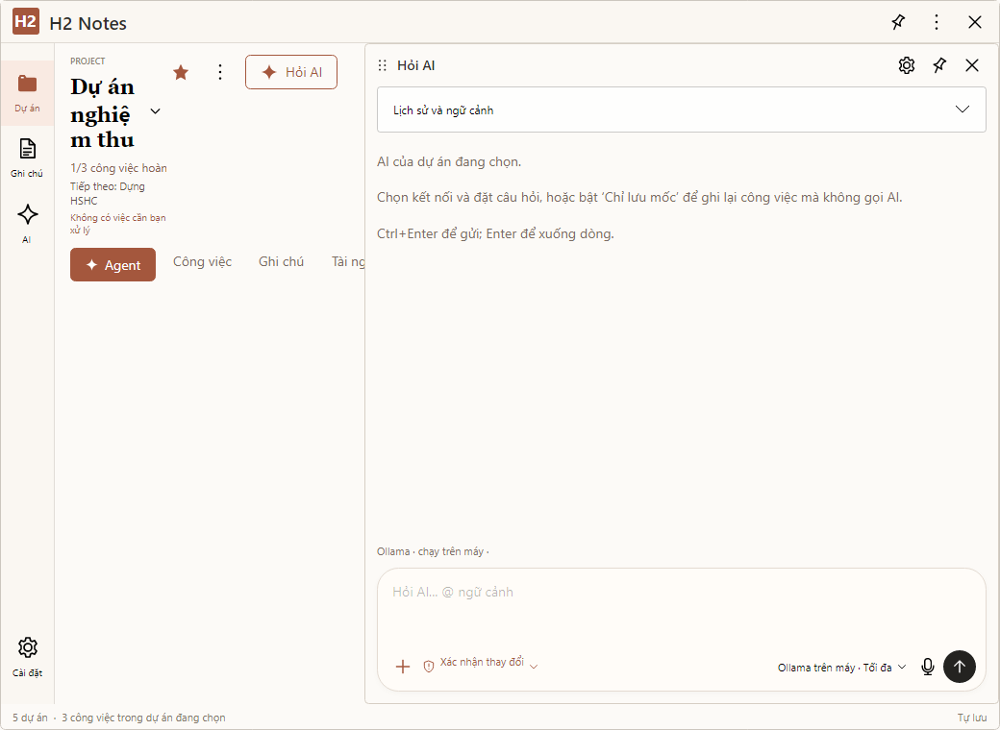
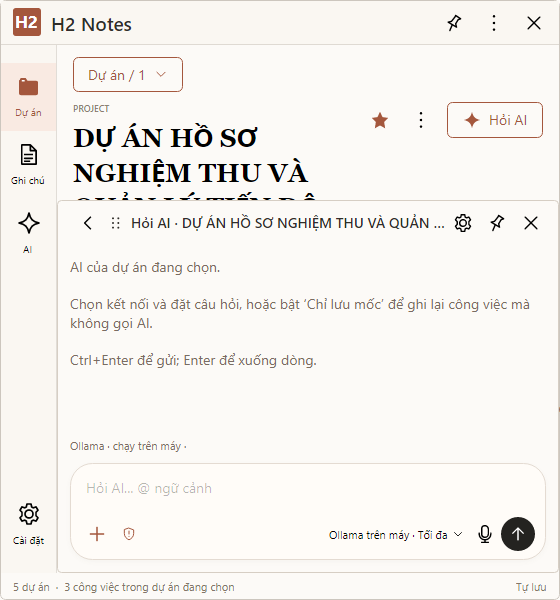

# Rà soát H2 Notes / H2 Agent — 21/09/2026

## Kết luận

**Có lỗi tích hợp thực tế và có khoảng cách giữa trạng thái đánh dấu hoàn thành với khả năng sử dụng của ứng dụng.** Lượt gửi `xin chào` bị chặn bởi chính sách xác minh do H2 tạo sai loại tác vụ; không có cơ sở quy lỗi này cho nhà cung cấp AI. Việc AI vẫn hoạt động trong ứng dụng khác phù hợp với chẩn đoán này.

Giao diện mới có trong mã và đã được bật: khởi động vào Command Center, mở dự án vào Agent workspace. Tuy nhiên nó đang dùng lại khung bố cục cũ với ràng buộc kích thước không phù hợp. Rà soát đã tái hiện tab bị che và khung chat đè lên tiêu đề. Không thể kết luận “đã thiết kế lại và nghiệm thu xong” từ số bài kiểm tra tự động.

Đây là **báo cáo phát hiện lỗi, chưa phải bản sửa Agent/UI**. Các sửa hàng đợi Coordinator đã có từ lượt làm việc trước được giữ nguyên; không gộp chúng thành bằng chứng Agent/UI đã được sửa.

## Mốc mã nguồn và phạm vi

- Kho: `HoangHung997/NotePad`, đã fetch toàn bộ remote refs/tags; clone đầy đủ, không shallow; không có submodule cần lấy thêm.
- Nhánh đang tiếp tục: `feature/nas-multi-device-sync`.
- HEAD và remote của nhánh cùng ở `9660a0f3000ea9c24d5e071160d22196baf4836a`; ahead/behind `0/0` tại thời điểm rà soát. Những thay đổi local chưa commit ở H2M-133F vẫn được bảo toàn.
- `origin/main` là dòng cũ; không tự trộn main vào nhánh đang triển khai chỉ để gọi là “đồng bộ”.
- Đọc các đặc tả gốc, lịch sử phê duyệt và tracker; lần theo đường chạy thực tế liên quan Agent, UI, đóng gói và nghiệm thu. Không tuyên bố đã kiểm tra thủ công từng dòng của toàn bộ 868 file được Git theo dõi.
- Không gọi model thật trong probe; không sửa dữ liệu người dùng để thử mutation. Chỉ đọc lỗi của lượt gửi gần nhất và cấu hình không chứa bí mật để đối chiếu.

### Tài liệu làm căn cứ

| Nhóm | Tài liệu đã đối chiếu | Cách áp dụng |
| --- | --- | --- |
| Sản phẩm hiện tại | `H2_PRODUCT_MASTER_SPEC.md`, `H2_PRODUCT_MASTER_TASKS.md` | Kiến trúc Command Center / Project Workspace ưu tiên AI / Work Assistant |
| Agent hiện tại | `H2_AGENT_MASTER_SPEC.md`, `H2_AGENT_MASTER_TASKS.md` | Engine, context, quyền, tools, verification, tiêu chí nghiệm thu |
| Biên tích hợp | `H2_AGENT_PUBLIC_INTEGRATION_BOUNDARY.md`, `H2_AGENT_ADAPTER_CONTRACT.md`, `H2_AGENT_USER_ACCEPTANCE_GATE.md` | H2 phải dùng một Agent qua hợp đồng rõ ràng; không nhầm đã có bridge với đủ khả năng production |
| Dữ liệu / nhiều máy | `H2_NOTES_NON_AI_BUG_LEDGER.md`, `H2_SYNC_COORDINATOR_EVENT_ARCHITECTURE.md`, `H2_NAS_REAL_ACCEPTANCE.md` | Kết quả NAS thật và chuyển sang Coordinator là căn cứ mới nhất |
| Thiết kế đã chốt | `APPROVED_PRODUCT_SPEC.md`, `UI_ACCEPTANCE.md`, `ui-concepts/2026-09-15-responsive-hybrid/README.md` và 10 ảnh gốc | Giữ chuẩn hình ảnh / tương tác còn hiệu lực; kiến trúc sản phẩm mới lấy từ Product Master |
| Báo cáo hoàn thành | `H2_RESPONSIVE_BEHAVIOR_ACCEPTANCE.md`, `H2_H11_PRODUCT_ACCEPTANCE.md`, `H2_H13_FINAL_PRODUCT_ACCEPTANCE.md` | Phân biệt fixture tự động với nghiệm thu thực tế |

Cả 10 PNG chuẩn vẫn khớp SHA-256 trong `BASELINE.json`. Không thay ảnh chuẩn để hợp thức hóa giao diện hiện tại. Kết quả nằm trong [baseline-hash-check.json](audit-evidence/2026-09-21/baseline-hash-check.json).

## Các phát hiện

P1: chặn chức năng chính hoặc thực thi quyền không đúng phạm vi. P2: hành vi sai, mất ngữ cảnh hoặc thông tin gây hiểu nhầm cần sửa trước nghiệm thu.

### A01 — P1: Nhầm quyền được sửa với yêu cầu phải sửa

**Đã tái hiện, khớp lỗi người dùng.** Lượt `xin chào` trong nhật ký Agent local kết thúc `Blocked`, không có `FinalText`, với lỗi:

> Task requires verification, but no verifier report exists before final completion.

Chuỗi nguyên nhân:

1. `src/H2Notes.Core/AiModels.cs:17`: hội thoại mặc định dùng `ConfirmChanges`.
2. `src/H2Notes.Avalonia/Controls/AiChatPanel.Agent.cs:41–42`: mọi chế độ khác `ReadOnly` đều thành `readOnly: false`.
3. `experiments/H2AgentLab/Integration/H2ProductionAgentAdapter.cs:299–302,441–471`: suy ra `NeedsAction=true`, yêu cầu có mutation và bắt buộc xác minh mutation.
4. Model trả lời bình thường, không có tool call; `latestVerification` vẫn null. `runtime/AgentRuntime.cs:194–196` đi thẳng tới completion gate tại dòng 697–699 và chặn tác vụ.
5. Adapter tại dòng 379–381 chuyển sang `Blocked` và bỏ câu trả lời.

Probe dùng **production adapter và runtime factory mặc định**, chỉ thay transport bằng câu trả lời cố định; không gọi mạng:

| Đầu vào | Kết quả |
| --- | --- |
| `xin chào`, quyền hiện tại `readOnly=false` | `Blocked`, đúng lỗi trên; transport đã trả `Xin chào!` |
| Cùng đầu vào/transport, `readOnly=true` | `Completed`, trả `Xin chào!` |

**Cần sửa:** tách intent/tiêu chí hoàn thành của tác vụ khỏi quyền được phép dùng. Chat thuần phải hoàn thành được trong chế độ xác nhận sửa. Mutation thực sự vẫn phải được cấp quyền và xác minh; đổi mặc định sang ReadOnly hoặc bỏ toàn bộ verification chỉ che lỗi.

### A02 — P1: Agent chờ duyệt nhưng UI không có đường duyệt/từ chối

**Xác nhận qua đường gọi production.** `H2ProductionAgentAdapter.cs:410–438` tạo `WaitingForApproval`, rồi chờ kết quả `RespondToApproval`. Toàn bộ `src/H2Notes.Avalonia` không có call tới thao tác này. `AiChatPanel.Agent.cs:137–140` chỉ hiện tiêu đề yêu cầu; Work Assistant cũng chỉ chiếu trạng thái.

Hai lựa chọn `ConfirmChanges` và `ProjectAccess` đều thành `readOnly=false`; context dự án tại `AiChatPanel.Agent.cs:278–281` không có PermissionScope. Vì thế cả hai cùng đi vào luồng chờ duyệt khi gọi công cụ cần phê duyệt, trong khi UI không thể hoàn tất nó. Đây là lỗi thiếu kết nối, không phải máy chủ AI bị treo.

**Cần sửa:** hiển thị chi tiết mục tiêu/thay đổi, nút đồng ý/từ chối, gắn đúng task/approval ID; xử lý hủy, hết hạn và đóng/mở lại. Kiểm tra từ UI thật tới adapter, thay vì chỉ gọi `RespondToApproval` trực tiếp trong test.

### A03 — P1: Công cụ sửa dự án chưa được đưa vào Agent production

**Xác nhận qua mã và danh sách tool runtime.** `src/H2Notes.Core/H2ProjectTools.cs:60` có các thao tác `AddTask`, `AppendNote`, `ReplaceNote`. Adapter có nhận project host nhưng chỉ dùng `ReadProject` để kiểm tra lúc start/attach (`H2ProductionAgentAdapter.cs:78,250`).

`runtime/AgentRuntimeFactory.cs:47` tạo `NormalRuntimeToolRegistry`; registry mặc định không có schema/executor gọi các mutation H2 nói trên. Vì vậy có host API và unit test riêng không đồng nghĩa model trong app có thể thêm công việc hoặc sửa ghi chú đúng đường đã thiết kế.

**Cần sửa:** nối typed project tools vào cùng runtime, có project/version/permission checks và verification. Không cho model sửa JSON dự án bằng công cụ file thô để thay cho luồng này. Rà lại mức hoàn thành H2M-073 và parity sau khi bỏ đường AI cũ.

### A04 — P1: Quyền giới hạn theo tài liệu chưa được đối chiếu tại lúc chạy tool

**Phân tích tĩnh có căn cứ; chưa thử mutation trên dữ liệu thật.** `H2ProductionAgentAdapter.cs:398–401` tự duyệt khi PermissionScope còn hạn, cho phép mutation và không cần xác nhận, nhưng không so tài nguyên tool với `ResourceKey`, `ScopeKind` hay document/session identity. `AgentRuntimeFactory.cs:61–62` cũng chỉ kiểm tra `!tools.ReadOnly`.

Trong khi đó `App.axaml.cs:27–34` lấy workspace từ thư mục dữ liệu H2. Một quyền “sửa workbook/session này” không được ràng buộc với đích ghi file khi hành động thực thi; công cụ file vẫn bị giới hạn bởi SafeWorkspace nhưng SafeWorkspace không thay thế quyền theo tài liệu. Không có bằng chứng đã xảy ra ghi sai dữ liệu người dùng; đây là lỗ hổng kiểm tra phạm vi trong mã.

**Cần sửa:** host phải kiểm tra identity, tài nguyên, hành động và hạn quyền ở từng tool call. Test từ chối mutation khác file/session dù cùng workspace. Xác minh sau ghi không thể thay thế việc chặn trước ghi. Rà lại H2M-086.

### A05 — P1: Khả năng Excel/Word live/Web/AutoCAD chưa được lắp vào cấu hình chạy mặc định

**Xác nhận bằng probe default factory.** Runtime có 19 tool generic: file, Python, Word file offline, skill, artifact và vài tên desktop. Không có các tool production typed cho Excel live, Word live, Web hay AutoCAD mà các kịch bản nghiệm thu mô tả. `AgentTools.Desktop` cũng chưa được gán tại `H2ProductionAgentAdapter.cs:287–294`; desktop executor sẽ báo không khả dụng (`Tools/NormalRuntimeToolRegistry.cs:1010`).

Các implementation và bài test tương ứng tồn tại ở Agent Lab. Vấn đề là **chưa được kết nối vào cấu hình production đang sử dụng**, không phải toàn bộ code của các khả năng đó đều không tồn tại.

**Cần sửa:** dùng composition chung đã được nghiệm thu để cấp đúng registry/providers/controllers/verifiers. Kiểm tra capability bằng default factory và bản app đóng gói; không cho test tự chèn registry khác rồi suy ra production đã đủ.

### A06 — P1: Thành phần DesktopHost trong output ứng dụng không khởi động được

**Đã tái hiện trên output local.** Thư mục `src/H2Notes.Avalonia/bin/Release/net10.0-windows` có EXE, deps và runtimeconfig của `H2AgentLab.DesktopHost`, nhưng thiếu DLL tương ứng. Khởi chạy helper không có pipe hợp lệ để kiểm tra khả năng nạp trả exit 1:

> The application to execute does not exist: '...H2AgentLab.DesktopHost.dll'.

`Desktop/SelectedDesktopWindowController.cs:28–53` chọn EXE mà không xác nhận bộ file đầy đủ. `experiments/H2AgentLab/H2AgentLab.csproj:21–38` copy helper vào output của chính Agent Lab; `src/H2Notes.Avalonia/H2Notes.Avalonia.csproj:16` tham chiếu project nhưng không bảo đảm toàn bộ file custom đó được chuyển tiếp vào output cuối.

**Giới hạn:** lỗi trên đã được chứng minh với bản build local. Chưa giải nén và chạy lại artifact portable lịch sử để khẳng định mọi bản phát hành trước đều thiếu cùng file.

**Cần sửa:** đóng gói helper và dependencies ở ứng dụng cuối; smoke test helper từ chính thư mục publish đã giải nén. Test helper trong project riêng không kiểm tra được lỗi này.

### A07 — P2: Chọn model và mức suy luận trong chat không quyết định model chạy

**Xác nhận bằng truy vết.** Picker lưu `conversation.ProfileId` (`AiChatPanel.cs:104,229`). Luồng gửi dự án không truyền profile/reasoning sang Agent. Resolver production ở `App.axaml.cs:309–321` luôn lấy global `_local.Ai.SelectedId`. Hàm áp dụng reasoning `AiChatPanel.Options.cs:42` chỉ còn được dùng ở đường legacy.

**Hậu quả:** giao diện có thể hiện lựa chọn B nhưng request chạy cấu hình A. Chưa thực hiện live call bằng hai tài khoản; kết luận dựa trên nguồn cấu hình thực sự được truyền tới transport.

**Cần sửa:** truyền lựa chọn đã resolve qua hợp đồng Agent, giữ key trong local secret boundary. Test global A/conversation B phải thực sự chạy B; reasoning phải khớp giao diện. Rà lại H2M-070/074.

### A08 — P2: Lịch sử chat và tài liệu đính kèm không đi đầy đủ vào context

**Xác nhận bằng truy vết.** Mỗi lần gửi tạo task/session mới (`AiChatPanel.Agent.cs:97`, adapter dòng 83,303). `BuildAgentTaskContext` tại dòng 220–281 chỉ chứa thông tin dự án, ghi chú/công việc và metadata attachment; không lấy `conversation.Messages`. `AgentContextInput` ở adapter dòng 308–310 chỉ nhận goal mới và summary đó.

Vì vậy câu “tiếp tục câu trước” thiếu chính lượt trước dù lịch sử vẫn hiện trên UI. Lựa chọn kèm các cuộc trao đổi khác chỉ được tiêu thụ ở đường legacy `AiChatPanel.Files.cs:59`.

Attachment chỉ gửi tên/hash và tối đa 1.500 ký tự text mỗi file, không có binary image/PDF hay resource handle/path để runtime truy cập đầy đủ. Không thể coi hiển thị chip đính kèm là bằng chứng Agent đã đọc file.

**Cần sửa:** context có các lượt liên quan trong giới hạn, tóm tắt có nguồn khi cần; nối file bằng resource handle hợp lệ và giữ lựa chọn phạm vi gửi dữ liệu. Test nhiều lượt và tài liệu vượt đoạn trích, không chỉ một prompt độc lập.

### A09 — P2: Nội dung nhiều dòng bị từ chối trước khi gọi AI

**Đã tái hiện offline.** `StartTaskAsync` dùng `BoundRequired(goal)` tại dòng 66; hàm ở `H2ProductionAgentAdapter.cs:592–599` cấm mọi `char.IsControl`, bao gồm xuống dòng và tab. Probe gửi prompt nhiều dòng nhận `ArgumentException: Value is empty, too long or contains control characters. (Parameter 'goal')`.

Điều này còn mâu thuẫn với hướng dẫn ngay trong composer: Enter để xuống dòng, Ctrl+Enter để gửi.

**Cần sửa:** tách validation nội dung người dùng khỏi validation định danh; cho phép CR/LF/tab, vẫn giới hạn độ dài và xử lý ký tự không phù hợp. Test prompt một dòng, nhiều dòng và text dán từ tài liệu.

### A10 — P1 về khả năng sử dụng: Bố cục Project Workspace che tab và tiêu đề

**Đã thấy trên render từ control thật và có số đo layout.** Đây là render Avalonia headless/Skia với dữ liệu tổng hợp, 96 DPI, không phải ảnh chụp cửa sổ Windows của người dùng.

- `MainWindow.axaml:120–129`: sáu tab nằm trên StackPanel ngang không tự xuống dòng.
- `MainWindow.Responsive.cs:341–346`: Agent mode ở cửa sổ rộng ép cột dự án còn 310 DIP; trừ lề chỉ còn 278 DIP cho header và dãy tab.
- Ở 1040×760, chat bắt đầu tại x=379. Tab Lịch sử nằm x=430 và Bằng chứng x=501, phía sau chat. Hit-test tại tâm hai tab trúng phần chat, không phải nút.
- Tiêu đề dự án ngắn cũng chỉ còn 73 DIP ngang ở trạng thái này, gây xuống dòng bất thường trong khi cửa sổ vẫn rất rộng.
- Ở 560×820 và 560×600, chat dùng top margin cố định 155 DIP (`Responsive.cs:365–367`), không tính chiều cao header. Với tên dài, tiêu đề ở y=119..322 còn chat đã bắt đầu tại y=200; tabs ở y=394 cũng bị phủ.

Ảnh bằng chứng:

**Vì sao vẫn giống cũ:** `MainWindow.axaml.cs:94–95` thực sự mở Command Center; `MainWindow.CommandCenter.cs:183–195` thực sự chuyển sang Agent khi mở dự án. Không có cờ đang tắt toàn bộ redesign. Nhưng khung chat và quy tắc chia cột/overlay cũ vẫn chi phối trang mới; có thêm màn hình và tab chưa đủ để đạt bố cục đã thống nhất.

**Cần sửa:** bố trí workspace bằng các vùng có kích thước đo thực tế; bảo đảm điều hướng luôn truy cập được; thiết kế hẹp thành một vùng nội dung rõ ràng. Kiểm tra app thật ở 560×600, 560×820, 1040×760, 1440×860 và nhiều DPI trước khi đánh dấu lại H2M-092/110.

### A11 — P2: Mục cần xử lý không mở đúng tác vụ; nhãn “verified” suy ra sai

**Xác nhận bằng mã.** `MainWindow.CommandCenter.cs:42–50` bỏ qua `AgentTaskId`, chỉ mở dự án. `MainWindow.History.cs:10` chỉ render hàng dữ liệu, chưa nối thao tác xem run tương ứng. Một mục lỗi/đợi duyệt cũ không dẫn người dùng tới đúng nguồn để xử lý như tracker yêu cầu.

`src/H2Notes.Core/H2ProductProjections.cs:340–355` dùng thời gian sửa dự án/công việc và run bất kỳ có evidence làm `LatestVerifiedActivity`. Hàm dòng 361–377 gán “Verified mutation” dựa trên chuỗi `mutation`, `verification`, `verified`, `patch`, `write` trong kind, không kiểm tra một báo cáo verifier đã PASS. Evidence ghi file hoặc báo cáo FAIL có thể được trình bày thành verified.

**Cần sửa:** deep link theo task/approval/evidence ID; chỉ trình bày xác minh thành công từ kết quả verification có cấu trúc. Phân biệt hoạt động thường, thao tác đã chạy, xác minh đạt và xác minh thất bại; hiển thị nội dung đã xác minh chứ không chỉ thời gian.

### A12 — Khoảng trống nghiệm thu và bản phát hành

**Đã đối chiếu source test, tracker và trạng thái CI.**

| Bằng chứng hiện có | Thực sự chứng minh | Chưa chứng minh |
| --- | --- | --- |
| H2M-110 test tại `H2ProductAcceptanceScenarioTests.cs:30–80` | Dữ liệu projection được gán vào UI, truy vấn chương trình nhanh | Người dùng nhìn app và hiểu trong 5–10 giây; tab đọc/bấm được |
| H2M-111 và H2M-115 dùng concrete adapter/runtime, factory mặc định | Luồng tích hợp chạy với model/transport fixture | Provider thật và trải nghiệm sử dụng thực tế |
| H2M-112..114 dùng concrete adapter/runtime | Các hợp đồng tích hợp chạy khi thay transport và cả registry/executor/verifier bằng fixture | App mặc định đủ tool; Excel/Word/AutoCAD/web thật |
| `RecordingExecutor` dòng 957 và `ScenarioVerifier` dòng 1025 | Kịch bản với kết quả cố định | Office/CAD thật đã được sửa và xác minh |
| `Program.cs:367` dùng Avalonia.Headless | Kiểm tra logic/control tự động | Windows input/IME/multi-DPI và parity trực quan |
| Bộ H2 Notes local 527/527 sau sửa queue | Những assertion hiện có đạt | Các lỗi A01–A11 không tồn tại |

H2M-110 tại tracker yêu cầu actual UX test, không chỉ unit test. Một số checkbox và diễn giải PASS ở H11 vượt quá phạm vi bằng chứng fixture. H13 có ghi rõ native DPI/IME chưa kiểm chứng; không nên diễn giải mọi phần tài liệu đều đã che giấu giới hạn. Tuy nhiên phần NAS trong H13 còn là snapshot cũ, trong khi tracker mới đã ghi ba lần chạy hai máy thất bại và quyết định chuyển Coordinator.

Tại HEAD remote `9660a0f`:

- [Avalonia workflow 35571798765](https://github.com/HoangHung997/NotePad/actions/runs/35571798765): failed tại H2 Notes regression; các bước publish tiếp theo bị skip, không có artifact mới.
- [NAS workflow 35571798683](https://github.com/HoangHung997/NotePad/actions/runs/35571798683): failed; không có bản publish mới từ head này.
- `bin/LATEST.txt` vẫn trỏ bản nguồn `176520661597657003aa3d89bd591a309642a262` (H2M-133E), giao qua Actions artifact; không có ZIP mới được version trong kho.

Do đó “đồng bộ mã nguồn”, “build local đạt” và “người dùng đang mở đúng bản phát hành mới” là ba trạng thái khác nhau. Việc phát hành đang lùi nguồn là một yếu tố cần kiểm tra; **không đủ căn cứ nói chỉ cần tải bản mới là giao diện/Agent hết lỗi**, vì đã tái hiện lỗi ngay trên mã hiện tại.

## Thứ tự khắc phục và tiêu chí đóng lỗi

1. **Khôi phục gửi/chat cơ bản:** A01, A09, A07, A08. Kiểm tra greeting ở quyền mặc định, nội dung nhiều dòng, đúng model, hội thoại nhiều lượt, file đính kèm. Không giảm yêu cầu xác minh của mutation để làm test xanh.
2. **Khép kín quyền và thao tác thật:** A02–A05. Gắn approval UI, kiểm quyền từng tài nguyên, nối project tools và các capability thực sự có. Test bằng production composition, rồi thử trên bản sao dữ liệu.
3. **Đóng gói đúng:** A06. Kiểm tra app và helpers từ thư mục publish sạch; ghi commit/hash cho đúng artifact.
4. **Hoàn thiện màn hình đã chốt:** A10–A11. Chỉnh layout trên cùng kiến trúc Product Master, giữ ảnh chuẩn; mở đúng task, hiển thị trạng thái xác minh đúng nghĩa. Chụp app thật theo size/DPI và kiểm tương tác.
5. **Cập nhật bằng chứng nghiệm thu:** phân loại rõ unit/integration fixture, production composition, native visual, live provider/Office và hai máy thật. Chỉ đóng phần tương ứng sau khi có đúng loại bằng chứng.
6. **Tiếp tục Coordinator:** giữ H2M-133F đang làm; nối hàng đợi/lease/barrier vào Agent production sau khi các lỗi tích hợp trên được xử lý. Harness một máy không thay thế nghiệm thu NAS/PC thật.

Không cần quay lại sửa toàn bộ engine từ đầu: engine V2 và transport thật đã được gọi. Trọng tâm là những chỗ nối H2 với engine, layout và cách nghiệm thu, nơi các đường chạy fixture đã không phản ánh đủ cấu hình người dùng thực sự mở.

## Bằng chứng và giới hạn

- [Kết quả probe Agent offline](audit-evidence/2026-09-21/agent-offline-probe.json): production factory mặc định, transport cố định; 0 network calls.
- [Số đo control](audit-evidence/2026-09-21/layout-measurements.json), [Command Center](audit-evidence/2026-09-21/command-center-1040.png), [Workspace rộng 1440](audit-evidence/2026-09-21/project-agent-1440.png), [Workspace hẹp 560](audit-evidence/2026-09-21/project-agent-560.png).
- Harness local tại `.artifacts/audit-2026-09-21/`; chi tiết phương pháp trong [README bằng chứng](audit-evidence/2026-09-21/README.md).
- Đã xem trực tiếp các ảnh render trong báo cáo; dữ liệu là fixture tổng hợp. Không dùng ảnh này để đánh dấu đạt parity/native input.
- Công cụ điều khiển desktop không liệt kê cửa sổ H2 frameless đang mở nên chưa chụp/điều khiển native app qua công cụ đó. Không giả lập kết quả nghiệm thu native.
- Không chạy lại toàn bộ regression chỉ vì thêm báo cáo. Kết quả 527/527 là lần chạy local trước trong cùng phiên; đợt audit chạy riêng probe nêu trên. Không chạy live AI, Office/AutoCAD hoặc hai PC thật trong audit này.
- Những findings phân tích tĩnh được ghi rõ. Báo cáo không khẳng định chưa còn lỗi khác ngoài danh sách này.
