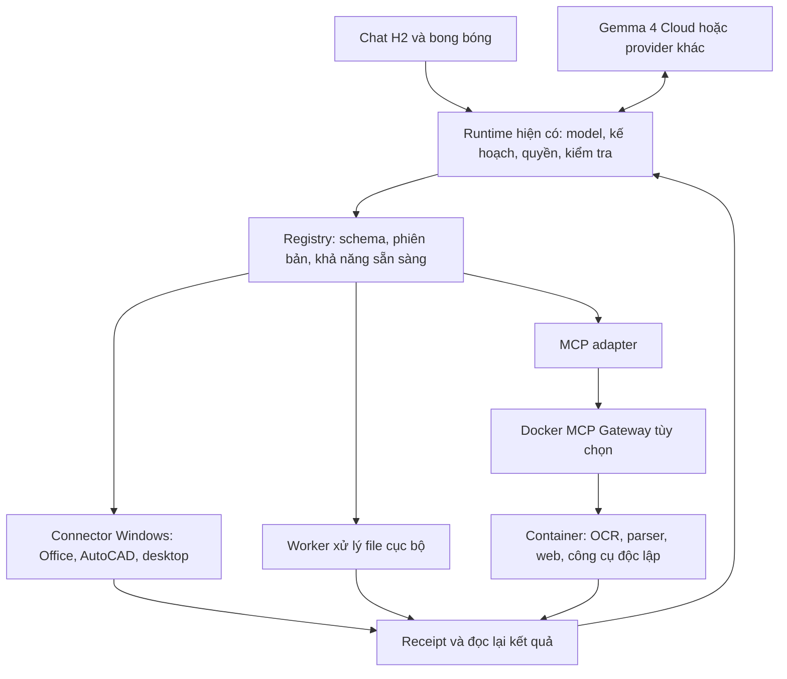

# Đối chiếu Docker và hướng cải thiện H2 Agent

Ngày khảo sát: **22/09/2026**. Trạng thái: **nghiên cứu và đề xuất, chưa triển khai**.

## 1. Kết luận đề xuất

Nên học cách Docker quản lý **hợp đồng công cụ, kết nối, trạng thái và đầu ra** để cải thiện runtime hiện có của H2. Ưu tiên sửa đường thực thi Office và việc xác nhận kết quả trước khi thay runtime hoặc thêm nhiều công cụ.

Kiến trúc phù hợp là: **H2 điều phối; Word/Excel/AutoCAD đang mở dùng connector Windows; công cụ xử lý file, OCR và MCP độc lập có thể dùng container tùy chọn**. Gemma 4 Cloud tiếp tục là một nhà cung cấp model. Đổi nơi chạy model không tự sửa được schema không khớp, nhận sai tài liệu hoặc lỗi kiểm tra sau khi ghi.

Đây là kết luận thiết kế rút ra từ các nguồn bên dưới, không phải kết quả benchmark Docker so với H2.

## 2. Phạm vi và nguồn khảo sát

- Đã đọc báo cáo người dùng cung cấp: `D:/Downloads/H2_DOCKER_RESEARCH_AND_APPLICATION_REPORT.md`.
- Báo cáo đó lấy H2 tại `fd5bfffb919047931d7051ddda1f482feffd626f`. Lượt này đối chiếu lại với **main `9265c75c4be60e4019d655ef049f66ffc6f779bc`**, sau các sửa lỗi và hợp nhất ngày 22/09.
- Đã truy cập trang Docker, tài liệu chính thức và tải các file mã nguồn được chọn theo commit cố định. Không chỉ dựa vào mô tả sản phẩm.
- Đã đọc các đường startup, factory, production tool session, Office client/server/backend, lịch sử chat, Web backend và MCP connection của H2.
- Chưa chạy Docker Agent/Gateway, chưa cài Docker, chưa chạy lại Excel/Word thật trong lượt nghiên cứu này. Các vấn đề mới dưới đây là phát hiện từ mã nguồn; chưa quy chúng thành nguyên nhân của một lượt lỗi mới cụ thể của người dùng.
- Những chỉ dẫn giao việc trong báo cáo đầu vào được xem là nội dung tham khảo. Tài liệu này không thay thế đặc tả sản phẩm đã duyệt, không tự thay đổi phạm vi NAS hay giao diện.

Các nguồn đã ghim:

| Kho | Commit khảo sát | Phần đọc chính |
|---|---|---|
| `docker/docker-agent` | `daf0f15a52bb210b9fbc49c93fa7540385e1f671` | Lifecycle supervisor/classifier/state, MCP call/reconnect, dispatcher, loop detector và một số test |
| `docker/mcp-gateway` | `a34df45d4ec0e941a9853ad768c4f6cd818966b3` | Client pool, initialize, capability validation, README |
| `moby/moby` | `4e92a43120a768f76c98acadd3e506a23ce34882` | Client và thương lượng phiên bản API |
| `docker/cli` | `4167943209e53a349ee3a425f8c5eca481991cfe` | Kiểm tra metadata/plugin/schema |
| `containerd/containerd` | `5152cb5d53254996c408da07fa607bfc6c69bfe4` | Client health check |
| `moby/buildkit` | `9215874dc2337bb1a12cd149340bd99d7c6ba8ac` | README về client/daemon, dependency graph và xuất kết quả |

Bản nguồn chọn lọc và manifest tại `.artifacts/docker-research-2026-09-22/` được bỏ qua bởi Git. Không tải toàn bộ sáu repository, không kiểm toán toàn bộ sản phẩm. Các liên kết theo commit trong tài liệu giúp kiểm tra lại mà không phụ thuộc thư mục tạm.

## 3. Cần phân biệt các phần của Docker

| Thành phần | Vai trò đã xác minh | Ý nghĩa với H2 |
|---|---|---|
| Docker Engine / Moby | Client gọi API của daemon để quản lý container, image, network và volume | Học cách tách giao diện khỏi bộ thực thi và phiên bản hóa API. [Docker Engine](https://docs.docker.com/engine/) |
| Docker Agent | Framework Agent mã nguồn mở, cấu hình model/tools bằng YAML; có thể chạy binary độc lập | Sát bài toán vòng chạy Agent. Có thể dùng làm đối chứng sau khi connector H2 ổn định. [Docker Agent](https://docs.docker.com/ai/docker-agent/) |
| MCP Gateway | Proxy điều phối MCP server, cấu hình, xác thực và định tuyến | Có thể là một backend mở rộng cho H2; không tự cung cấp ngữ nghĩa sửa Word/Excel. [MCP Gateway](https://docs.docker.com/ai/mcp-catalog-and-toolkit/mcp-gateway/) |
| Docker Model Runner | Quản lý và phục vụ model qua API | Lựa chọn inference riêng; không thay thế connector hay verifier. [Model Runner](https://docs.docker.com/ai/model-runner/) |
| Docker Desktop | Sản phẩm tích hợp nhiều thành phần, có điều khoản phân phối riêng | Không đồng nhất toàn bộ Desktop với một kho mã nguồn mở có thể sao chép vào bản portable. [Thông tin Desktop](https://docs.docker.com/subscription-billing/desktop-license/) |

Docker Agent và Gordon (`docker ai`) cũng là hai sản phẩm khác nhau. Không dùng mô tả khả năng của Gordon để suy ra khả năng của mã Docker Agent đã đọc.

## 4. Những cơ chế nên học từ mã nguồn

### 4.1. Quản lý kết nối bằng trạng thái rõ ràng

Docker Agent có các trạng thái `Stopped`, `Starting`, `Ready`, `Degraded`, `Restarting`, `Failed`. Supervisor tuần tự hóa startup, dùng backoff, giới hạn số lần kết nối lại và phát hiện crash liên tiếp. Timeout khởi tạo được xử lý để tránh tạo nhiều kết nối dang dở chồng nhau. [State](https://github.com/docker/docker-agent/blob/daf0f15a52bb210b9fbc49c93fa7540385e1f671/pkg/tools/lifecycle/state.go), [Supervisor](https://github.com/docker/docker-agent/blob/daf0f15a52bb210b9fbc49c93fa7540385e1f671/pkg/tools/lifecycle/supervisor.go)

**Áp dụng:** mở rộng connection/provider hiện có của H2 với trạng thái và lý do cụ thể. Một lần mở helper thành công chưa đủ để công bố công cụ sẵn sàng. Khi helper khởi động lại, tăng `providerEpoch`, hủy binding/cache cũ, khám phá lại tài liệu trước khi tiếp tục.

### 4.2. Phân lỗi kết nối với lỗi cấu hình/quyền

Classifier của Docker Agent phân biệt lỗi transport/session với thiếu capability hoặc cần xác thực. Hai nhóm sau không được supervisor tự lặp kết nối như lỗi tạm thời. [Classifier](https://github.com/docker/docker-agent/blob/daf0f15a52bb210b9fbc49c93fa7540385e1f671/pkg/tools/lifecycle/classify.go)

**Áp dụng:** lỗi sai tham số, thiếu ứng dụng, tài liệu đã đổi, Office đang bận, mất kết nối và không rõ kết quả ghi phải có mã riêng. Model cần biết nên sửa đối số, đọc lại, chờ ứng dụng, hay dừng để xác minh; một mã `tool_failed` khó hỗ trợ quyết định đó.

### 4.3. Đồng bộ danh mục công cụ với phiên kết nối

Docker Agent xóa cache khi mất kết nối và tải lại tool/prompt khi kết nối lại. MCP Gateway giữ client theo cặp server–session, tránh tạo trùng khi nhiều yêu cầu cùng đến; server được initialize trước khi trả client. Gateway còn lọc metadata capability không hợp lệ trước khi đăng ký vào server đang phục vụ. [Cache lifecycle](https://github.com/docker/docker-agent/blob/daf0f15a52bb210b9fbc49c93fa7540385e1f671/pkg/tools/mcp/mcp.go#L349), [Client pool](https://github.com/docker/mcp-gateway/blob/a34df45d4ec0e941a9853ad768c4f6cd818966b3/pkg/gateway/clientpool.go#L86), [Capability validation](https://github.com/docker/mcp-gateway/blob/a34df45d4ec0e941a9853ad768c4f6cd818966b3/pkg/gateway/capability_validation.go)

**Áp dụng:** runtime chỉ đưa cho model schema thuộc provider/version/epoch đang dùng. Quyền và đường dẫn tài liệu thuộc phiên H2, không lấy theo tên tool hoặc model tự mô tả. Danh mục cần nói rõ tool nào đang thiếu cấu hình thay vì báo cả nhóm là Ready.

### 4.4. Kiểm tra trước thực thi và hạn chế vòng lặp

Dispatcher Docker Agent kiểm tra tool có tồn tại, lấy executor từ định nghĩa đã đăng ký và đi qua chuỗi kiểm tra quyền trước khi chạy. Loop detector so tên/đối số đã chuẩn hóa để phát hiện lặp lại cùng một batch; có ngoại lệ cho các tool chờ trạng thái. [Dispatcher](https://github.com/docker/docker-agent/blob/daf0f15a52bb210b9fbc49c93fa7540385e1f671/pkg/runtime/toolexec/dispatcher.go#L367), [Loop detector](https://github.com/docker/docker-agent/blob/daf0f15a52bb210b9fbc49c93fa7540385e1f671/pkg/runtime/toolexec/loop_detector.go)

**Áp dụng:** H2 đã có registry, permission policy, scheduler và giới hạn vòng sửa lỗi; giữ các nền tảng này. Bổ sung phát hiện lặp không tiến triển, nhưng phải cho phép một thao tác được sửa lại có bằng chứng mới hoặc token mới hợp lệ. Không chặn mọi lần gọi giống tên.

### 4.5. Phiên bản và readiness phải kiểm tra được

Moby client kiểm tra phiên bản API tối thiểu và chọn phiên bản tương thích. Docker CLI kiểm tra metadata/schema của plugin. `containerd.Client.IsServing` hỏi health service thay vì chỉ kiểm tra có process. [Moby client](https://github.com/moby/moby/blob/4e92a43120a768f76c98acadd3e506a23ce34882/client/client.go#L331), [CLI plugin](https://github.com/docker/cli/blob/4167943209e53a349ee3a425f8c5eca481991cfe/cli-plugins/manager/plugin.go#L62), [containerd health](https://github.com/containerd/containerd/blob/5152cb5d53254996c408da07fa607bfc6c69bfe4/client/client.go#L305)

**Áp dụng:** handshake production phải xác minh protocol/version, backend thật hay fixture, danh sách capability và giới hạn. Ping được không có nghĩa Excel đã mở hoặc có quyền ghi tài liệu đang chọn.

### 4.6. Tách tính toán khỏi xuất kết quả cho người dùng

BuildKit phân biệt kết quả/cache nội bộ với đầu ra được xuất; có kết quả build nội bộ chưa đồng nghĩa đã có file ở đích người dùng. [BuildKit output](https://github.com/moby/buildkit/blob/9215874dc2337bb1a12cd149340bd99d7c6ba8ac/README.md#output)

**Đề xuất tương tự cho H2:** `đã tạo bản nháp → đã kiểm tra nội dung → đã lưu tới đích → đã đọc lại đích`. Trạng thái mở trong ứng dụng là một bằng chứng riêng. Với NAS, không biến việc tạo file local thành thông báo đã đồng bộ thành công.

### 4.7. Những phần không nên sao chép nguyên

- Trong commit khảo sát, `callTool` của Docker Agent có nhánh kết nối lại rồi gọi lại một lần khi lỗi transport/session. Nhánh này không tự kiểm tra ngữ nghĩa ghi tài liệu của H2. **Khôi phục kết nối không chứng minh lần ghi trước chưa xảy ra.** H2 cần chính sách replay riêng cho tool ghi. [Đường retry cụ thể](https://github.com/docker/docker-agent/blob/daf0f15a52bb210b9fbc49c93fa7540385e1f671/pkg/tools/mcp/mcp.go#L744)
- Cùng file đó tách timeout của một lệnh khỏi vòng đời session. Đây là ý tưởng cần học; nhưng COM bị treo có thể không hủy hợp tác được. H2 vẫn có thể cần dừng helper do mình sở hữu, đồng thời đánh dấu kết quả ghi là chưa xác định và đọc lại tài nguyên.
- Dynamic MCP vẫn được tài liệu Docker ghi là experimental; tool thêm động chỉ thuộc phiên hiện tại. Code mode được mô tả là chưa đáng tin cậy cho sử dụng tổng quát. Chưa nên dùng nó làm nền bắt buộc của H2. [Dynamic MCP](https://docs.docker.com/ai/mcp-catalog-and-toolkit/dynamic-mcp/)
- Container không cấp thêm năng lực nghiệp vụ cho model và không làm thao tác file có tính giao dịch tự động. Mỗi connector vẫn phải chịu trách nhiệm về quyền, tài nguyên đích và kiểm tra đầu ra.

## 5. Đính chính các nhận định trong báo cáo đầu vào

Các trạng thái trong bảng là kết quả đọc code hiện tại, không phải một đợt nghiệm thu chạy thật mới.

| Mục báo cáo | Đối chiếu main hiện tại | Kết luận |
|---|---|---|
| F01: adapter mặc định unavailable | Startup gọi `ComposeProductionAgent`; method này tạo `H2ProductionAgentAdapter`. [H01] | Đã có production binding; không kết luận app vẫn chỉ chạy placeholder |
| F02: bắt buộc có ProjectId | Production `StartTaskAsync` nhận `Guid?`; null dùng cho quick task, chỉ từ chối `Guid.Empty`. [H02] | Contract production đã hỗ trợ ngoài dự án |
| F03: lịch sử chỉ trong RAM | Có archive, JSON từng task/thread, atomic write và nạp lại khi khởi động. [H03] | Có đường lưu bền vững; điều này chưa chứng minh mọi yêu cầu đồng bộ dự án/NAS |
| F04: extension có mặt nhưng chưa chắc nối runtime | Factory gọi `ProductionSession.Configure`; session đăng ký Office/Web/desktop và các tool theo điều kiện. [H04] | Đã chứng minh đường nối các domain này; không suy rộng mọi plugin/MCP có trong repo đều đã được app công bố |
| F05: discovery Excel đọc cả workbook | `DiscoverExcel` hiện chỉ đọc metadata, trả token trống; snapshot được lấy riêng. [H05] | Đã sửa |
| F06: snapshot Excel lớn/token lẫn selection | Vẫn đọc UsedRange, giới hạn 5.000 ô; basis token còn active sheet/selection/saved. [H06] | Vẫn cần range snapshot và tách nội dung khỏi trạng thái giao diện |
| F07: identity phụ thuộc active COM/HWND/path | `FindExcel/FindWord` vẫn lấy một active COM app; ID dùng HWND/name/path. [H07] | Rủi ro multi-instance/Save As còn cần giải quyết và thử thật |
| F08: Office timeout 10 giây | Mặc định client là 10 giây, nhưng production Office dùng **60 giây**; capture foreground dùng 3 giây. Client vẫn dừng helper khi timeout riêng của nó. [H08] | Nhận định thời gian production trong báo cáo đã cũ; vấn đề kết quả ghi không xác định vẫn cần xử lý |
| F09: search chưa cấu hình vẫn Ready | Backend tổng quát còn điểm này; production chỉ nạp fetch/download/extract/metadata/feed. [H09] | Đã tránh quảng bá `web.search` chưa cấu hình; chưa phải đã triển khai search |
| F10: browser fallback chỉ trả URL | Method đó còn nguyên nhưng production không đăng ký tool này. [H09] | Không dùng method đó để kết luận browser production đã hoạt động; cũng không kết luận production vẫn quảng bá nó |
| F11: Last-Modified thành PublishedAt | Vẫn có phép gán đó. [H10] | Cần tách ngày sửa HTTP khỏi ngày xuất bản và nguồn xác nhận |

Sửa lỗi Word CV đã có preflight, xử lý xuống dòng, ledger cho lần bị từ chối trước ghi và native readback. Xem [báo cáo Word đã có](H2_WORD_CV_REPAIR_2026-09-22.md). Không nên bỏ các sửa này khi đổi kiến trúc. Các kết quả kiểm tra trước đó chỉ chứng minh những tình huống đã thử, không phủ hết mọi tài liệu/công cụ.

## 6. Phát hiện bổ sung trên main hiện tại

### N01 — Hợp đồng Excel không khớp giữa hai tầng

`H2OfficeRuntimeTools` công bố `maxItems = 200` và chấp nhận 1–200 ô; `ComOfficeBackend.PatchExcel` chỉ nhận 1–128. Yêu cầu 129–200 ô đúng theo schema gửi model vẫn bị backend từ chối. [H11], [H12]

**Sửa ưu tiên:** dùng chung giới hạn/hợp đồng hoặc chia batch có precondition và kết quả từng batch rõ ràng. Thử tại 128, 129 và 200; không chỉ thử vài ô.

### N02 — Ghi vào ô mới có thể thành công rồi bị báo lỗi

Sau `PatchExcelAsync` và snapshot lại, production tạo expected cells bằng `patch.Before...Cells.Single(c => c.Address == cell.Address)`. Snapshot cũ chỉ chứa UsedRange. Nếu ghi một ô hợp lệ ngoài vùng cũ, lookup này có thể không có phần tử và ném lỗi **sau khi đã ghi**. [H11]

Ví dụ cần tái hiện: sheet có dữ liệu A1:B2, ghi D10. Cần đọc trạng thái ô đích trước khi ghi kể cả ô chưa thuộc UsedRange, chuẩn hóa địa chỉ và kiểm tra sau ghi độc lập. Không chỉ thay `Single` bằng giá trị rỗng tùy ý vì ô trống vẫn có thể mang định dạng/merge/protection.

### N03 — Batch Excel có thể thay đổi một phần trước lỗi

Backend kiểm từng địa chỉ bên trong vòng lặp đang thực hiện thay đổi. Ví dụ phần tử đầu hợp lệ, phần tử sau sai địa chỉ: phần tử đầu có thể đã được áp dụng trước khi ném lỗi. Hoặc snapshot sau ghi có thể vượt giới hạn 5.000 ô khi UsedRange mở rộng. Đường trả lỗi chưa cung cấp đầy đủ danh sách đã áp dụng/chưa áp dụng. [H12], [H06]

**Sửa ưu tiên:** kiểm toàn bộ batch và dự báo vùng đọc trước ghi; lưu receipt từng bước và đọc lại khi gián đoạn. Preflight giảm lỗi nhưng không biến COM thành giao dịch atomic. Không hoàn tác mù khi người dùng có thể vừa chỉnh cùng tài liệu.

### N04 — Thời gian chờ và lỗi chung chưa biểu diễn được kết quả ghi

Office client tạo request ID nhưng đường đọc response chưa kiểm tra ID khớp; production tool client chưa bắt buộc ping/đối chiếu protocol trước lệnh đầu tiên. Có diagnostic riêng, nhưng nó không thay thế handshake bắt buộc trên đường chạy thật. [H08]

Wrapper giữ được mã lỗi Office đã định nghĩa, nhưng timeout và một số lỗi khác vẫn về `tool_failed` kèm hướng dẫn kiểm tra rồi retry. Chưa có kết quả có cấu trúc như `not_started`, `partially_applied`, `applied`, `unknown` ở ranh giới này. [H13]

**Sửa ưu tiên:** correlation ID, kiểm phiên bản, thời hạn theo pha, receipt và reconciliation. Không coi timeout là bằng chứng rollback hoặc chưa thực hiện.

### N05 — MCP hiện có cần siết lại trước khi nối Gateway vào app

`McpServerConnection.CallAsync` thử kết nối/gọi lại khi gặp mọi exception ngoài cancellation, tối đa theo số lần cấu hình. Nó chưa phân biệt read/write hoặc lỗi nghiệp vụ với lỗi kết nối ở nhánh này. Initialize hiện chấp nhận protocolVersion là chuỗi không rỗng, chưa kiểm tập phiên bản hỗ trợ. [H14]

Đây là phát hiện về lớp MCP có sẵn. Lượt này chưa chứng minh app production đang dùng lớp đó cho sự cố người dùng gặp. Cần hoàn thiện nó và chứng minh registration/transport thật trước khi tuyên bố H2 kết nối được mọi app qua MCP.

## 7. Kiến trúc đề xuất cho H2

Đây là sơ đồ đề xuất, không phải mô tả tất cả kết nối đã có trên app.

Office cần connector trong phiên Windows tương tác, xử lý đúng STA và trạng thái ứng dụng bận. Microsoft xác nhận object model Office không thread-safe, còn Windows container không hỗ trợ ứng dụng cần desktop GUI. Vì vậy không chuyển phiên Word/Excel/AutoCAD đang mở vào container chỉ để sửa lỗi gọi tool. [Office threading](https://learn.microsoft.com/en-us/visualstudio/vsto/threading-support-in-office?view=vs-2022), [Giới hạn Windows container](https://learn.microsoft.com/en-us/virtualization/windowscontainers/quick-start/lift-shift-to-containers)

Nên bổ sung vào các lớp hiện có thay vì tạo runtime song song:

| Nơi hiện có | Phần bổ sung đề xuất |
|---|---|
| `ToolDescriptor` / registry / provider | Schema dùng chung, capability readiness, provider version/epoch, chính sách replay |
| `OfficeHostClient` và server | Handshake, kiểm ID, receipt, timeout theo pha và xác minh kết quả sau gián đoạn |
| `ComOfficeBackend` / Office runtime tools | Discovery nhiều instance, ID tài liệu ổn định trong phiên, snapshot theo range, preflight/partial result |
| `McpServerConnection` | Phân lỗi, giới hạn/backoff kết nối, handshake tương thích, refresh tools và không tự replay lệnh ghi chưa rõ kết quả |
| `PluginManager` / capability adapter | Tận dụng manifest/hash/version đã có; chứng minh đường nối production, không tạo manager thứ hai |
| Verifier / artifact store / archive | Receipt theo operation, trạng thái xuất file, đọc lại đúng đích và khôi phục sau restart |

Một operation nên có `operationId`, `tool/version`, `providerEpoch`, tài liệu/vùng đích, precondition, phạm vi quyền, thời hạn, trạng thái thực hiện và evidence. Receipt phải tồn tại ngoài bộ nhớ tiến trình thực thi nếu muốn kiểm tra sau crash. Receipt riêng lẻ không bảo đảm exactly-once khi crash xảy ra giữa side effect và ghi receipt; trường hợp không xác minh được phải giữ trạng thái **chưa rõ kết quả**, không gọi lại như thể chưa từng chạy.

Quyền Full Access có thể bỏ bước hỏi từng thao tác theo lựa chọn người dùng, nhưng vẫn phải kiểm đúng tài nguyên, schema và kết quả. Có quyền ghi không đồng nghĩa ứng dụng đang sẵn sàng hoặc thao tác đã thành công.

Với máy chưa có Docker: giữ đường chạy native của bản portable. Chỉ bật backend container khi môi trường đó sẵn sàng; không để chức năng cơ bản phụ thuộc cài Docker. Nếu dùng container, mount vùng làm việc cần thiết, tách credential khỏi dữ liệu dự án và xác minh đầu ra ở phía H2.

## 8. Thứ tự triển khai và cách kiểm chứng

| Ưu tiên | Công việc | Điều kiện hoàn thành |
|---|---|---|
| P0 | Sửa N01–N03, đọc lại đúng ô/vùng, phân biệt chưa ghi/ghi một phần/không rõ | Các lỗi Excel biên có case tái hiện và kiểm tra nội dung độc lập; không báo thất bại đơn thuần rồi ghi trùng |
| P0 | Thu trace production cho lỗi người dùng, cùng executor chạy trực tiếp không qua LLM | Xác định lỗi ở model arguments, binding, executor hay verifier; không đoán từ lời trả lời của AI |
| P1 | Lifecycle/handshake/epoch và replay policy cho Office/MCP | Lỗi crash, timeout, sai phiên bản, mất phản hồi được phân loại; không thực hiện lại lệnh ghi chưa xác minh |
| P1 | Snapshot theo range và binding nhiều instance/Save As | Workbook lớn, file chưa lưu, hai instance, đổi selection và Save As không làm chọn nhầm tài liệu |
| P2 | Readiness theo capability và metadata Web | Có search backend thật thì mới công bố search; ngày xuất bản có nguồn, không dùng Last-Modified thay thế |
| P2 | Thử một backend Docker MCP hoặc worker OCR độc lập | Qua đúng registry/quyền/evidence của H2; vẫn chạy được chức năng native khi thiếu Docker |
| P3 | Cân nhắc Docker Agent làm runtime đối chứng | Cùng model, input, connector, quyền và verifier; có số đo hơn/kém trước khi quyết định thay runtime |

Đề nghị tạo dữ liệu tổng hợp trong thư mục test riêng và chạy tối thiểu ba lượt độc lập cho mỗi case chính:

1. Excel: 128/129/200 ô; D10 ngoài UsedRange cũ; địa chỉ chữ thường; batch có phần tử lỗi ở giữa; UsedRange vượt 5.000; công thức/format/merge cần bảo toàn.
2. Office: hai instance, hai cửa sổ một tài liệu, file chưa lưu, Save As, chuyển selection, người dùng sửa xen giữa snapshot–patch, hộp thoại modal.
3. Gián đoạn: trước ghi, giữa batch, sau ghi trước response, timeout, helper crash, hủy tác vụ, app khởi động lại. Kiểm cả đầu ra, receipt và số lần side effect.
4. Word: hồi quy CV/xuống dòng và format hỗn hợp đã sửa; không bỏ test bảo toàn bảng/header/footer/section.
5. Web: fetch thành công/search thiếu cấu hình, redirect, giới hạn tải, tin không có ngày xuất bản, Last-Modified khác ngày xuất bản.
6. MCP: metadata hỏng, version không hỗ trợ, mất phiên, lỗi xác thực, server restart thay schema; đọc có thể retry theo policy, ghi phải xác minh trước replay.
7. File/OCR/CAD: file thật do worker tạo phải mở/đọc lại bằng công cụ độc lập; ghi nhận loại file/engine thực dùng. DXF thành công không được tự quy thành DWG thành công. Giữ giới hạn CAD/phần mềm phụ thuộc rõ ràng.

Chạy theo ba mức: **executor thật không LLM → cùng executor qua Gemma 4 Cloud → app production UI**. Nếu cần so Docker Agent, thêm mức đối chứng thứ tư dùng cùng connector. Thay cả runtime, model và connector một lúc sẽ không biết yếu tố nào cải thiện.

Log cần ghi task/call/operation ID, phiên bản, pha lỗi, latency, phạm vi đích đã khử dữ liệu nhạy cảm, retry count và outcome; không lưu API key hoặc toàn bộ tài liệu cá nhân. Báo cáo số thành công/số lần thử theo từng case, thời gian và số tác vụ sai trạng thái; không dùng tổng số unit test để tuyên bố mọi công cụ ổn định.

## 9. Bằng chứng H2 theo commit khảo sát

[H01]: https://github.com/HoangHung997/NotePad/blob/9265c75c4be60e4019d655ef049f66ffc6f779bc/src/H2Notes.Avalonia/App.axaml.cs#L145
[H02]: https://github.com/HoangHung997/NotePad/blob/9265c75c4be60e4019d655ef049f66ffc6f779bc/experiments/H2AgentLab/Integration/H2ProductionAgentAdapter.cs#L67
[H03]: https://github.com/HoangHung997/NotePad/blob/9265c75c4be60e4019d655ef049f66ffc6f779bc/experiments/H2AgentLab/Integration/H2ProductionAgentAdapter.Chat.cs#L64
[H04]: https://github.com/HoangHung997/NotePad/blob/9265c75c4be60e4019d655ef049f66ffc6f779bc/experiments/H2AgentLab/Runtime/AgentRuntimeFactory.cs#L47
[H05]: https://github.com/HoangHung997/NotePad/blob/9265c75c4be60e4019d655ef049f66ffc6f779bc/experiments/H2AgentLab.OfficeHost/ComOfficeBackend.cs#L19
[H06]: https://github.com/HoangHung997/NotePad/blob/9265c75c4be60e4019d655ef049f66ffc6f779bc/experiments/H2AgentLab.OfficeHost/ComOfficeBackend.cs#L331
[H07]: https://github.com/HoangHung997/NotePad/blob/9265c75c4be60e4019d655ef049f66ffc6f779bc/experiments/H2AgentLab.OfficeHost/ComOfficeBackend.cs#L947
[H08]: https://github.com/HoangHung997/NotePad/blob/9265c75c4be60e4019d655ef049f66ffc6f779bc/experiments/H2AgentLab/Office/OfficeHostClient.cs#L105
[H09]: https://github.com/HoangHung997/NotePad/blob/9265c75c4be60e4019d655ef049f66ffc6f779bc/experiments/H2AgentLab/Integration/H2ProductionToolSession.Domains.cs#L25
[H10]: https://github.com/HoangHung997/NotePad/blob/9265c75c4be60e4019d655ef049f66ffc6f779bc/experiments/H2AgentLab/Web/WebResearchHost.cs#L89
[H11]: https://github.com/HoangHung997/NotePad/blob/9265c75c4be60e4019d655ef049f66ffc6f779bc/experiments/H2AgentLab/Integration/H2OfficeRuntimeTools.cs#L22
[H12]: https://github.com/HoangHung997/NotePad/blob/9265c75c4be60e4019d655ef049f66ffc6f779bc/experiments/H2AgentLab.OfficeHost/ComOfficeBackend.cs#L59
[H13]: https://github.com/HoangHung997/NotePad/blob/9265c75c4be60e4019d655ef049f66ffc6f779bc/experiments/H2AgentLab/Integration/H2ProductionToolSession.cs#L79
[H14]: https://github.com/HoangHung997/NotePad/blob/9265c75c4be60e4019d655ef049f66ffc6f779bc/experiments/H2AgentLab/Providers/McpServerConnection.cs#L71

Các link H08/H11 cần đọc cùng nhau để phân biệt timeout mặc định của client và timeout production. Capture foreground 3 giây nằm ở `H2ProductionAgentAdapter.Context.cs:39`. Startup tạo adapter nằm ở `App.axaml.cs:336`. H03 bao gồm archive từng task ở cuối file, không chỉ dictionary thread.

## 10. Trạng thái bàn giao nghiên cứu

Đã tạo tài liệu đối chiếu và giữ nguồn khảo sát chọn lọc. Chưa thay mã ứng dụng, chưa đổi model, chưa sửa tài liệu người dùng hay phát hành bản mới. Các đề xuất P0–P3 là công việc tiếp theo, không được tính là đã sửa/đã đạt nghiệm thu.
