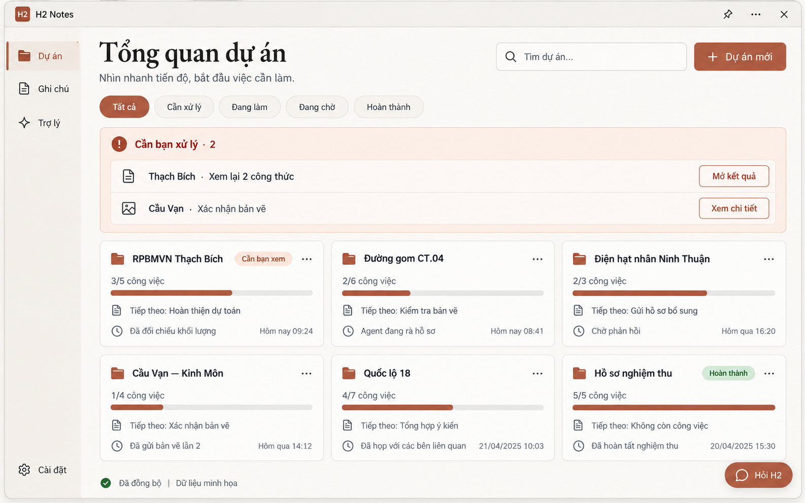
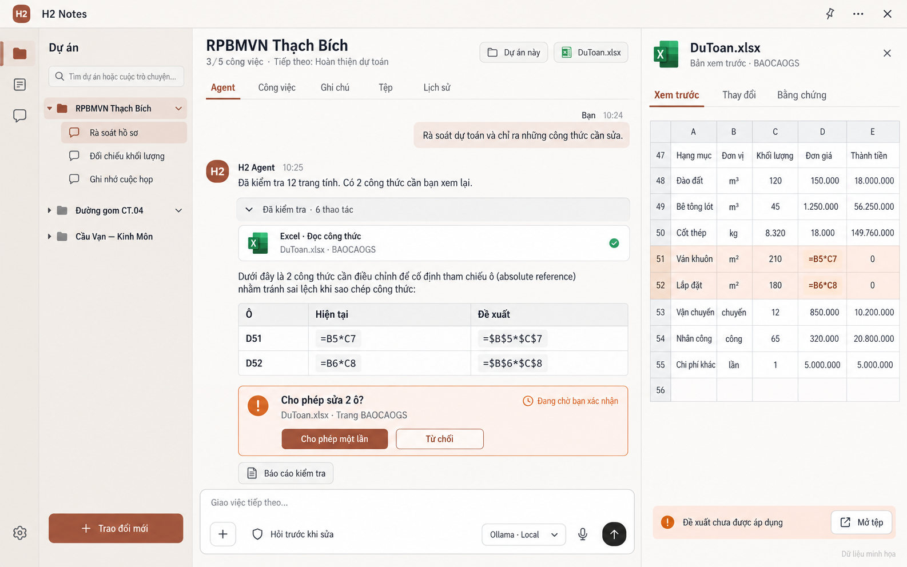
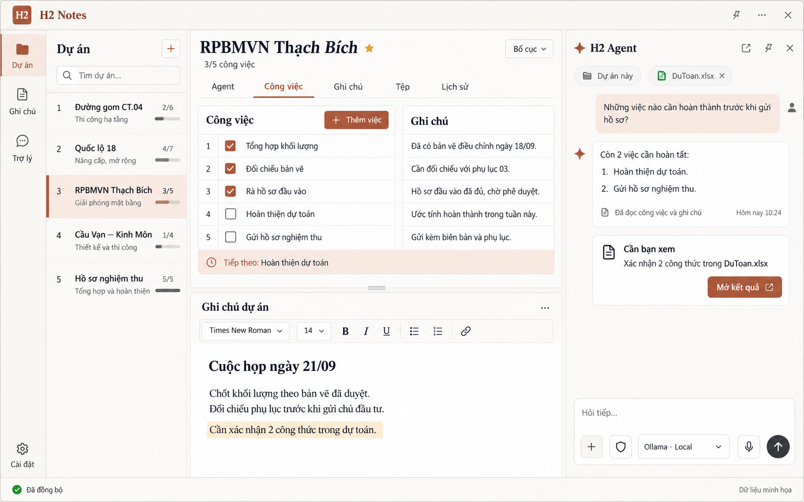

# H2 Notes — ảnh demo dựng lại giao diện

Ngày: 21/09/2026. Trạng thái: **đề xuất để người dùng xem, chưa được duyệt làm baseline**.

Ba ảnh được tạo bằng công cụ imagegen tích hợp, với dữ liệu minh họa. Đây là ba bố cục bổ sung cho cùng ứng dụng, có thể kết hợp; không phải bằng chứng app đã triển khai hoặc nghiệm thu. Giữ nguyên bộ mười ảnh và BASELINE.json ngày 15/09.

## 01 — Tổng quan dự án

Các thẻ dự án, việc cần xử lý, tiến độ công việc và lối gọi trợ lý nhanh.

## 02 — Agent và tài liệu

Dự án/hội thoại bên trái, Agent ở giữa, tài liệu bên phải. Thẻ duyệt thay đổi nằm trong hội thoại, kết quả chưa áp dụng được ghi rõ.

## 03 — Công việc, ghi chú và Agent

Chế độ chi tiết kết hợp: công việc/ghi chú ở giữa, Agent ghim bên phải; giữ gần bố cục hybrid lịch sử. Có thể là lựa chọn bổ sung bên cạnh workspace Agent mặc định.

## Định hướng sử dụng

Đề xuất: 01 làm trang mở đầu, 02 làm không gian Agent chính, 03 là chế độ chỉnh công việc/ghi chú khi cần. Những trạng thái khác như cửa sổ hẹp, Work Assistant nhỏ và cài đặt cần ảnh riêng ở bước sau.

Đã xem trực tiếp ba ảnh: bố cục và chữ chính đọc được, tông ivory/terracotta nhất quán. Các số liệu, giờ, bảng Excel và nội dung đều là dữ liệu giả; nhãn/phông/khoảng cách vẫn cần chuẩn hóa khi thiết kế chi tiết. Ảnh raster không chứng minh tương tác hay khả năng backend.

[Prompt đầy đủ](PROMPTS.md). Công cụ: imagegen tích hợp, không dùng CLI/API riêng. Không sửa mã ứng dụng trong lần tạo demo này.

